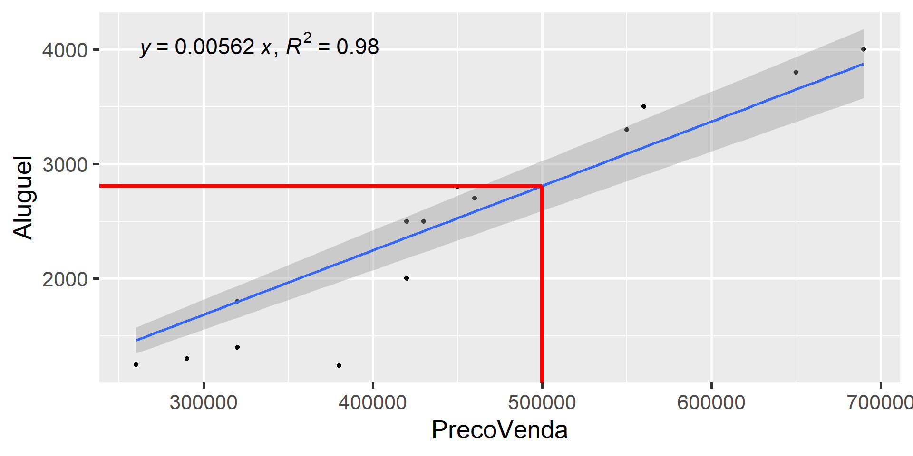
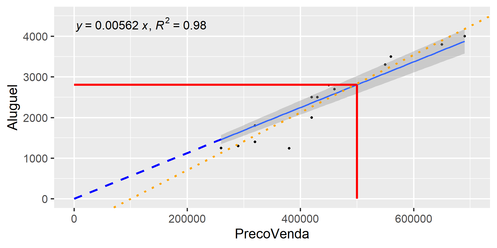
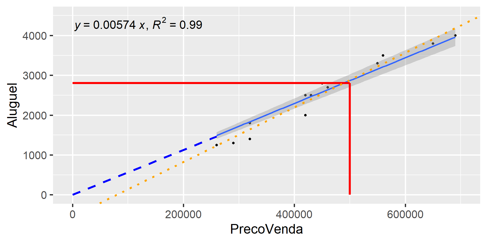
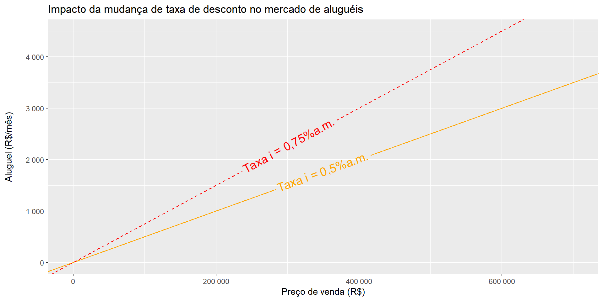

## Introdução {.smaller}

-   Aluguéis são essenciais para a compreensão do mercado imobiliário

    | Estoque          | Fluxo               |
    |------------------|---------------------|
    | Riqueza          | Renda               |
    | Dívida Pública   | Déficit Público     |
    | Ação             | Dividendo           |
    | Valor de um casa | Aluguel de uma casa |

    : Fonte: Adaptada de @Malpezzi2002TheRO.

-   Os imóveis são bens heterogêneos:

    -   Assim como utilizamos os imóveis para morar
    -   Utilizamos os imóveis para auferir renda imobiliária
    -   Assim, os imóveis são bens de consumo ("*service logement*", de acordo com [@granelle; *apud* @lacerda2020])
    -   Mas também são "bien d’investissement" (Idem)

## Relação entre Estoque e Fluxo:


::: {.cell}

:::

::: {.cell}
::: {.cell-output-display}
{#fig-FC width=50%}
:::
:::


# Matemática Financeira

## Essencial de Matemática Financeira {.smaller}

-   Valor Presente Líquido de um investimento:

. . .

$$
VPL = -I + \sum_{t=1}^T \frac{R_t - C_t}{(1+i)^t}
$$ {#eq-vpl}

-   Quando o fluxo de caixa é constante, o VPL também pode ser escrito em função do Fator de Recuperação do Capital (FRC):

. . .

$$
VPL = -I + \frac{R_l}{FRC(i,T)}
$$ {#eq-vpl2}

-   Pode-se considerar, ainda, um valor residual $D$ ao final do período de análise:

. . .

$$
VPL = -I + \frac{R_l}{FRC(i,T)} + D.FAC(i,T)
$$ {#eq-vpl3}

:::: {.columns}

::: {.column width="50%"}
- $$FRC(i, T) = \frac{i.(1+i)^T}{(1+i)^T-1}$$ {#eq-frc}
:::

::: {.column width="50%"}
- $$FAC(i,T) = \frac{1}{(1+i)^T}$$ {#eq-fac}
:::

::::


## Essencial de Matemática Financeira {.smaller}

-   FRC e FAC podem ser tabelados!

-   FRC:

. . .


::: {.cell}
::: {.cell-output-display}


|  n|     1%|     2%|     3%|     4%|     5%|     6%|     7%|     8%|     9%|    10%|
|--:|------:|------:|------:|------:|------:|------:|------:|------:|------:|------:|
|  1| 1.0100| 1.0200| 1.0300| 1.0400| 1.0500| 1.0600| 1.0700| 1.0800| 1.0900| 1.1000|
|  2| 0.5075| 0.5150| 0.5226| 0.5302| 0.5378| 0.5454| 0.5531| 0.5608| 0.5685| 0.5762|
|  3| 0.3400| 0.3468| 0.3535| 0.3603| 0.3672| 0.3741| 0.3811| 0.3880| 0.3951| 0.4021|
|  4| 0.2563| 0.2626| 0.2690| 0.2755| 0.2820| 0.2886| 0.2952| 0.3019| 0.3087| 0.3155|
|  5| 0.2060| 0.2122| 0.2184| 0.2246| 0.2310| 0.2374| 0.2439| 0.2505| 0.2571| 0.2638|
|  6| 0.1725| 0.1785| 0.1846| 0.1908| 0.1970| 0.2034| 0.2098| 0.2163| 0.2229| 0.2296|


:::
:::


-   FAC:

. . .


::: {.cell}
::: {.cell-output-display}


|  n|     1%|     2%|     3%|     4%|     5%|     6%|     7%|     8%|     9%|    10%|
|--:|------:|------:|------:|------:|------:|------:|------:|------:|------:|------:|
|  1| 0.9901| 0.9804| 0.9709| 0.9615| 0.9524| 0.9434| 0.9346| 0.9259| 0.9174| 0.9091|
|  2| 0.9803| 0.9612| 0.9426| 0.9246| 0.9070| 0.8900| 0.8734| 0.8573| 0.8417| 0.8264|
|  3| 0.9706| 0.9423| 0.9151| 0.8890| 0.8638| 0.8396| 0.8163| 0.7938| 0.7722| 0.7513|
|  4| 0.9610| 0.9238| 0.8885| 0.8548| 0.8227| 0.7921| 0.7629| 0.7350| 0.7084| 0.6830|
|  5| 0.9515| 0.9057| 0.8626| 0.8219| 0.7835| 0.7473| 0.7130| 0.6806| 0.6499| 0.6209|
|  6| 0.9420| 0.8880| 0.8375| 0.7903| 0.7462| 0.7050| 0.6663| 0.6302| 0.5963| 0.5645|


:::
:::


## Essencial de Matemática Financeira {.smaller}

-   Exemplo 1:
    -   Compra de um carro por R\$ 95.000,00 à vista, deixando de pagar aluguel de R\$ 24.000,00/ano.
    -   Em 5 anos, a uma TMA de 8,0% a.a., este investimento se paga?
    -   Desconsiderar seguros, IPVA, etc.
        -   $I = 95.000,00$, $R = 24.000,00$, $i=8,00\% a.a.$, $T=5$
        -   $FRC(8\%, 5) = \frac{0,08.(1+0,08)^{5}}{(1+0,08)^{5}-1} \approx 0,25$
        -   $VPL = -95.000 + 24.000/0,25 = -95.000 + 96.000$
        -   $VPL \approx - 1.000,00$
-   Exemplo 2:
    -   Mesmo exemplo anterior, considerando que o carro pode ser vendido a 60% do valor de aquisição ao final do período.
    -   Considerar também um custo de R\$ 12.000,00 por ano em manutenções, IPVA, etc.
        -   $I = 95.000,00$, $R = 24.000,00$, $C = 12.000$, $i=8,00\% a.a.$, $T=5$, $VF = 57.000$
        -   $FAC(8\%,5) = 1/(1 +.08)^5 =0,6806$
        -   $VPL = -95.000 + (24.000-12.000)/0,25 +  57.000\times0,6806 \approx -95.000 + 48.000 + 38.800$
        -   $VPL \approx -8.200,00$

## Essencial de Matemática Financeira {.smaller}

-   Exemplo 3:
    -   Compra de uma geladeira de R\$ 4.000,00 em 12x R\$ 400,00, com uma TMA igual a 10,0 % a.a.:
        -   $I = -4.000$, $R = -400$, $i = (1+0,01)^{1/12} - 1 = 0,80\% a.m.$
        -   $FRC(0,8\%, 12) = \frac{0,008.(1+0,008)^{12}}{(1+0,008)^{12}-1} = 0,0877$
        -   $VPL = -(-4.000) + (-400)/0,0877 = 4.000 - 4.561,00$
        -   $VPL \approx -560,00$
-   Exemplo 4:
    -   Considerar que com a nova geladeira haverá uma economia de R\$50,00 mensais com energia:
        -   $I = -4.000$, $R = -400$, $C = -50,00$, $i = (1+0,08)^{1/12} - 1 = 0,80\% a.m.$
        -   $FRC(0,8\%, 12) = 0,0877$
        -   $VPL = -(-4.000) + [-400 - (-50)]/0,0877 = 4.000 - 350/0,0877$
        -   $VPL  \approx 10,00$

## Reflexões {.smaller}

-   O importante é compreender o problema, ao invés de apenas aplicar as fórmulas
    -   No caso do carro, a ideia geral não é um cálculo exato, mas apenas criar uma percepção se vale a pena comprar ou alugar um carro
        -   Dificilmente os valores do fluxo de caixa real serão idênticos aos previstos
        -   O problema pode ser posto de maneira simplificada, inicialmente.
        -   Após uma primeira conta para aferir a ordem de grandeza das parcelas, o problema pode ser feito mais complexo
    -   No caso da geladeira, o importante é perceber:
        -   A decisão pode ser entre comprar a geladeira agora de forma parcelada, ou guardar o dinheiro das prestações para comprar depois, à vista!
        -   Se a pessoa opta por comprar a geladeira à vista após o período de 12 meses, ela deixou de economizar R\$ 50,00 mensais com a conta de energia durante este período
        -   Seria um erro desconsiderar esta economia "operacional"
        -   A decisão entre comprar agora ou comprar depois depende também de outras coisas. Quem garante que a geladeira estará por R\$ 4.000,00 daqui a 12 meses?
-   A TMA é exclusividade do empreendedor/indivíduo!
    -   Se o cidadão tem guardado apenas R\$ 4.000,00, ele só irá comprar a geladeira à vista se ele tiver um ótimo desconto!
    -   Se o cidadão possui uma boa poupança e R\$ 4.000,00 não é para ele um montante significativo, então ele pode comprar a vista, por mínimo que seja o desconto.

## Essencial de Matemática Financeira {.smaller}

-   Para períodos muito longos ($n \rightarrow \infty$), $FRC = i$!

-   Exemplo: taxa de 10%a.a., durante 30/40/50 anos, calcule a FRC:

    -   $FRC(10\%,30) = \frac{10\%.(1+10\%)^{30}}{(1+10\%)^{30}-1} = \frac{10\%.17,45}{16,45} = 0,1061 = 10,61\%$
    -  $FRC(10\%,40) = \frac{10\%.(1+10\%)^{40}}{(1+10\%)^{40}-1} = \frac{10\%.45,26}{44,26} = 0,1023 = 10,23\%$
    -  $FRC(10\%,50) = \frac{10\%.(1+10\%)^{50}}{(1+10\%)^{50}-1} = \frac{10\%.117,39}{116,39} = 0,1009 = 10,09\%$

-   Assim, para investimentos com FC muito longos, a equação [-@eq-vpl2] torna-se:

    -   $$VPL = -I + \frac{R}{i}$$ {#eq-vpl3}

-   Da equação [-@eq-vpl3] derivam (VPL = 0):

:::: {.columns}

::: {.column width="50%"}
-   O método da renda: $$V_{imóvel} = \frac{Al}{i}$$ {#eq-metodoRenda}
:::

::: {.column width="50%"}
-   O método da remuneração do capital: $$Al = V_{imóvel}.i$$ {#eq-metodoRemuneracaoCapital}
:::

::::

    
## Essencial de Matemática Financeira {.smaller}

### Métoda da Renda

  - Um imóvel tem aluguel igual a R$ 3.000,00 mensais, calcule seu valor de venda:
    - $$V_{imóvel} = \frac{Al}{i} = \frac{12.3000}{6\%}=\text{ R\$ } 600.000,00$$ 

-   Mais preciso: 
  - $$V_{imóvel} = \frac{Al}{i} = \frac{3000}{(1+6\%)^{1/12}-1}=\text{ R\$ } 616.326,40$$
  
### Método da Recuperação do Capital

  - Um imóvel possui VM de R$ 500.000,00, calcule o valor justo do aluguel, para uma taxa de 6% a.a.
    - $$Al = V_{imóvel}.i = \frac{500.000\times6\%}{12}=\text{ R\$ } 2.500,00$$
    
- Mais preciso:
  - $$Al = V_{imóvel}.i = 500.000\times[(1+6\%)^{1/12}-1] \approx \text{ R\$ } 2.435,00$$

## Essencial de Matemática Financeira {.smaller}

-   Para calcular a renda (ou prestação de um empréstimo) sobre um valor presente de um ativo, dada uma taxa de juros $i$, em $n$ períodos, basta considerar $VPL = 0$ e substituir ([-@eq-frc]) em ([-@eq-vpl2]):

    -   $R = PV\frac{i.(1+i)^n}{(1+i)^n-1}$ ou $R = \frac{PV.i}{1-(1+i)^{-n}}$
    -   Exemplo:
        -   Dado um valor presente de R\$ 4.000,00, a uma taxa de 0,76% a.m., calcule a prestação para pagamento em 12x:
        -   $R = \frac{4000.0,76\%}{1-(1+0,76\%)^{-12}} = \frac{30,4}{1 - 0,91315} \approx 350,00$

-   Para calcular o valor presente, dada a renda, os juros e número de prestações:

    -   $PV = R\frac{(1+i)^n-1}{i.(1+i)^n}$ ou $PV = \frac{R.(1-(1+i)^{-n})}{i}$
    -   Exemplo:
        -   Dada uma prestação de R\$ 1.000 mensais, a uma taxa de juros de 0,64% a.m., calcular o valor presente, considerando n = 60
        -   $PV = \frac{1.000.(1-(1+0,64\%)^{-60})}{0,64\%}=\frac{1.000.(1-0,6819)}{0,64\%}$
        -   $PV \approx 49.700,00$

-   O período de capitalização importa!

## Essencial de Matemática Financeira {.smaller}

-   Revisitando o exemplo 2:

    -   $I = 95.000,00$, $R = 2.000,00$, $C = 1.000$, $i=0,64\% a.m.$, $T=60$, $VF = 57.000$
    -   $FRC(0,64\%, 60) = \frac{0,0064.(1+0,0064)^{60}}{(1+0,0064)^{60}-1} \approx 0,02$
    -   $FAC(0,64\%, 60) \approx FAC(8\%, 5) = 0,6806$
    -   $VPL = -95.000 + \frac{2.000-1.000}{0,02} +  57.000\times 0,6806 = -95.000 + 50.000 + 38.800$
    -   $VPL \approx -6.200,00$

## Essencial de Matemática Financeira {.smaller}

### Taxa interna de retorno

-   Dados os valores do investimento ($I$), a Renda ($R$), o Custo ($C$) e o número de períodos ($T$), a TIR é o valor da taxa $i$ que zera o VPL na equação [-@eq-vpl]:

    -   $$0 = -I  + \sum_{t=1}^T \frac{R_t - C_t}{(1+TIR)^t}$$ {#eq-tir}

-   Se $TIR > TMA$: aceita-se o projeto!

-   Caso contrário, rejeita-se!

-   A TIR é muito utilizada nas empresas para comparar diferentes projetos

-   Por exemplo:

    -   Construtora pode investir R\$ 1.000.000,00 num terreno cujo VGV estimado é de R\$ 10.000.000,00, com prazo de entrega de 5 anos
    -   Ou pode investir R\$ 800.000,00 em outro terreno cujo VGV estimado é de R\$ 8.000.000,00, com prazo de entrega de 4 anos
    -   Considere que as receitas sejam constantes, anualmente.
    -   Considere que o lucro sobre as receitas seja de 20%
    -   Se a TMA da construtora é de 15% a.a., qual projeto escolher?

## Essencial de Matemática Financeira {.smaller}

### Comparação por VPL

-   Cálculo dos FRC:
    -   $FRC(15\%, 5) = \frac{0,15.(1+0,15)^5}{(1+0,15)^5-1} = 0,2983$
    -   $FRC(15\%, 4) = \frac{0,15.(1+0,15)^4}{(1+0,15)^4-1} = 0,3503$
-   Cálculo dos VPL:
    -   $$VPL_1 = -1.000.000 + \frac{20\% 2.000.000}{0,2983} = \frac{400.000}{0,2983} = R\$ 340.931,90$$
    -   $$VPL_2 = -800.000 + \frac{20\% 2.000.000}{0,3503} = \frac{400.000}{0,3503} = R\$ 341.878,40$$
    -   Os dois projetos são aceitáveis! Os VPL's são praticamente idênticos!

- Analisando os FC e os VPL, algumas pessoas podem pensar:
  - "Os dois projetos são similares, porém no primeiro a construtora lucra por 1 ano a mais"
  - "A construtora investe 200.000 a mais, porém fatura 25% mais e portanto lucra 400.000 a mais"!
    - "Portanto, vale a pena investir 200.000 mais e fazer o projeto com maior VGV!"
  
## Essencial de Matemática Financeira {.smaller}

### Comparação por TIR

-   Cálculos das TIR:
    - $$TIR_1 \Rightarrow 0 = -1.000.000  + \sum_{t=1}^5 \frac{400.000}{(1+TIR_1)^5}$$
      - $$TIR_1 = 28,65\%$$
    - $$TIR_2 \Rightarrow 0 = -800.000  + \sum_{t=1}^4 \frac{400.000}{(1+TIR_1)^4}$$
      - $$TIR_2 = 34,90\%$$
    
- Ao contrário do raciocínio falacioso do último slide, a TIR elenca o projeto 2
como o mais rentável para a construtora!
    
## Essencial de Matemática Financeira {.smaller}

### Indicadores: rentabilidade e lucratividade

-   Lucratividade: a lucratividade é a razão do lucro líquido sobre a receita bruta:´

:::: {.columns}

::: {.column width="50%"}
- Projeto 1: $$L_1 = \frac{L_{líquido}}{R_{bruta}} = \frac{400.000}{2.000.000} = 20\%/\text{ano}$$
:::

::: {.column width="50%"}
- Projeto 2: $$L_2 = \frac{L_{líquido}}{R_{bruta}} = \frac{400.000}{2.000.000} = 20\%/\text{ano}$$
:::

::::


-   Rentabilidade: é a razão do lucro sobre o investimento:

:::: {.columns}

::: {.column width="50%"}
- Projeto 1: $$r_1 = \frac{VPL_1}{I_1}= \frac{341.000}{1.000.000} = 34,10\%$$
:::

::: {.column width="50%"}
- Projeto 2: $$r_2 = \frac{VPL_2}{I_2}= \frac{341.000}{800.000} = 42,625\%$$
:::

::::

- O raciocínio é o seguinte: o VPL é o mesmo para ambos os projetos, porém no 
projeto 2 o investimento é menor (e retorna mais rápido)!

# Avaliação de Aluguéis

## Método da Renda {.smaller}

- O método da Renda é um dos métodos reconhecidos pela @NBR1465302 para 
"identificar o valor de um bem".

- Em outras palavras, o método da Renda é um método para a estimação do valor de
mercado de um bem imóvel.

- O método da renda consiste em utilizar a renda (aluguel) que um imóvel produz
fins de determinar o seu valor de mercado.

- Antigamente alguns autores se referiam ao método da renda também quando
utilizado para a determinação do valor justo do aluguel dos imóveis

- Na atualidade, para este segundo propósito, adotou-se o termo de *Método de 
Recuperação do Capital*

- Na @NBR1465302 [item 11.4.2], quando utilizado o método da recuperação do
capital para determinação dos aluguéis:
  - Neste caso, o aluguel é determinado em função do valor do imóvel, podendo 
  ser empregado em casos de imóveis isolados e atípicos, para os quais a
  utilização da comparação direta seja impraticável.
  - Sua utilização exige a determinação da taxa de remuneração e do valor do
  imóvel.
  - A taxa de remuneração deve ser objeto de pesquisa específica para cada caso,
  pois varia para cada tipo de imóvel, localização e, também, ao longo do tempo,
  dependendo da conjuntura econômica.

## Método da Remuneração do Capital {.smaller}

-   Segundo @damato, p. 123:

. . .

> Apesar de ser método de grande aplicação, alguns estudiosos já estão percebendo a inversão "causa-efeito" da premissa de que todo imóvel vale (efeito) pela sua capacidade de produzir renda (causa). Talvez o fato de se partir do "efeito" (valor do imóvel) para se obter a "causa" (renda) conduza a resultados distorcidos da realidade, a menos que nos cálculos se apliquem múltiplos fatores corretivos; para o terreno: localização, área, testada, profundidade, formato, sub ou superaproveitamento; para a construção: áreas privativa e total, grupamento, padrão, idade, estado de conservação, distribuição entre andares e dos ambientes (layout). \[…\] Na realidade se verifica que são dois mercados diferentes, o de venda e o de locação, com tendência, comportamentos e público alvo também diversos.

-   Obs. Droubi:
    -   São dois mercados diferentes!
    -   Mas eles se equilibram!

## Método da Remuneração do Capital

-   É o inverso do método da renda [@damato, p. 95]!

. . .

> "quando usado inversamente, para fixação de aluguéis, o método denominar-se-á da remuneração dos capitais"

-   A taxa de remuneração deve ser determinada mediante pesquisa, conforme item 11.4.2 da NBR 14.653-2 [-@NBR1465302]:

. . .

> A taxa de remuneração deve ser objeto de pesquisa específica para cada caso, pois varia para cada tipo de imóvel, localização e, também ao longo do tempo, dependendo da conjuntura econômica.

## Método da Remuneração do Capital {.smaller}

-   Deve-se levar em conta:

    -   Taxa de Vacância
    -   Taxas de administração
    -   Impostos
    -   Compensação pela falta de liquidez
    -   Manutenção e Depreciação
    -   Valorização

-   Um método é levar em conta estas variáveis na taxa de desconto:

    | Tipo             | Terreno (% a.a.) | Benfeitorias (%a.a.) |
    |------------------|------------------|----------------------|
    | Taxa básica      | 8,00%            | 8,00%                |
    | Não-liquidez     | 1,50%            | 1,50%                |
    | Depreciação      | \-               | 1,50%                |
    | Taxa de vacância | \-               | 1,00%                |
    | Valorização      | -1,50%           | \-                   |
    | TOTAL            | 8,00%            | 12,50%               |

    : Fonte: Composição de taxas de desconto. Fonte: @damato, p. 86.

## Taxa composta

-   Uma vez obtidas as taxas de desconto para o terreno e para as benfeitorias, 
pode-se calcular a **taxa composta**:

    -   $i=\frac{V_T.i_T+V_B.i_B}{V_T + V_B}$

-   Com a taxa composta, os valores do terreno e do capital (benfeitorias), pode
ser feito o cálculo do valor do aluguel.

-   Exemplo (adaptado de @damato, p. 87):

    -   $V_T = 250.000,00$
    -   $V_B = 450.000,00$
    -   $V_I = 795.000,00$ (Fator de Comercialização $\approx$ 14%)
    -   $i = \frac{250.000.0,08+450.000.0,125}{250.000 + 450.000} = \frac{20.000 + 56.250}{700.000} = 10,89% (a.a.)$
    -   Taxa ao mês: $i_{mensal} = (1+i_{anual})^{1/12} - 1 = 0,865\%$
    -   $Al = 795.000,00.0,865\% = \text{R\$ }6.876,75/\text{mês}$

## Método da Renda com aluguel líquido

-   Segundo @Malpezzi2002TheRO:
    -   $$V_{imovel} = \sum_{t=0}^{T}\frac{E(R_t-C_t)}{(1+i)^t} = \sum_{t=0}^{T}\frac{E(R_l)}{(1+i)^t} \approx \frac{R_l}{i}$$
-   Obs.: A valorização ($g$) pode ser levada em conta subtraindo-a da taxa de desconto [@Malpezzi2002TheRO]:
    -   $$V_{imovel} = \frac{R_l}{i-g}$$
    -   $i-g$ é chamada de taxa de capitalização, ou $c$ (*cap rate*)
    -   $$V_{imovel} = \frac{R_l}{c}$$

## Método da Renda com aluguel líquido {.smaller}

-   Segundo @damato, p. 100, deve-se deduzir, em média, 30% do aluguel bruto!

    -   $$V_{imóvel} = \frac{Al}{i} = \frac{12.0,7.3000}{6\%}=\text{ R\$ } 420.000,00$$

-   Estimando-se uma taxa de valorização de 2% a.a.:

    -   $$V_{imóvel} = \frac{Al}{i} = \frac{12.0,7.3000}{6\%-2\%}=\text{ R\$ } 630.000,00$$

-   Pequenos ajustes fazem grande diferença no VP!

## O investimento em imóveis {.smaller}

-   Exemplo:
    -   Dado que um apartamento está anunciado em R\$ 400.000,00
    -   Que a sua (investidor) TMA é igual 10% a.a.
    -   Que o aluguel do imóvel é R\$ 3.000,00/mês
    -   Que a expectativa é que o aluguel se reajuste a uma taxa de 1,5% a.a.
    -   Que os custos (inclusive taxa de vacância) são da ordem de 30% do valor 
    do aluguel
    -   Que você (investidor) considera um prazo de 30 anos para amortizar o
    investimento
    -   Quanto você pode pagar pelo apartamento?
-   Solução:
    -   $$FRC(8,5\%, 30) = \frac{8,5\%.(1+8,5\%)^{30}}{(1+8,5\%)^{30}-1} = 0,09305$$
    -   $$VPL = -400.000 + \frac{12.(3000-900)}{9,305\%}$$
    -   $$VPL = -400.000 + 270.822,10 = -129.177,90$$
    -   R.: R\$ 270.000,00

## O investimento em imóveis {.smaller}

### A casa própria

-   Suponha que:
    -   Uma casa está anunciada por R\$ 500.000,00
    -   Você pode financiá-la, mediante entrada de 20% (R\$ 100.000)
    -   Após adquirí-la, você pagará ao banco uma parcela de R\$ 2.000,00 mensais por 30 anos
    -   O aluguel da casa é R\$ 3.000,00 mensais
    -   A sua TMA é de 10% a.a.
    -   Você compra a casa?
    -   Considere que não há valor residual e despreze os custos de manutenção da casa, inflação, etc.!
-   Solução:
    -   $$FRC(10\%, 30) = \frac{10\%.(1+10\%)^{30}}{(1+10\%)^{30}-1} = 10,61\%$$
    -   $$VPL = -100.000 + \frac{12.(3000-2000)}{10,61\%}$$
    -   $$VPL = -100.000 + \frac{12.000}{10,61\%} = -100.000 + 113.100,80 = 13.100,80$$

## O investimento em imóveis {.smaller}

### A casa própria (2)

-   Suponha que:
    -   Um terreno está anunciado por R\$ 100.000,00
    -   Você quer construir uma casa com orçamento de R\$ 400.000,00
    -   Você pode fazer ATC, mediante entrada de 20% (R\$ 100.000)
    -   Você pagará ao banco inicialmente uma parcela de R\$ 5.000,00 mensais
    -   Porém, ao longo de 30 anos esta parcela será reduzida a uma taxa de 2,5% a.a.
    -   O aluguel de uma casa similar é R\$ 4.000,00 mensais
    -   Porém estima-se que este aumentará a uma taxa de 2,5% a.a.
    -   A sua TMA é de 10% a.a.
    -   Você estima uma valor residual, ao final de 30 anos, de 20% para o imóvel.
    -   Você compra a casa?
    -   Despreze os custos de manutenção e outras taxas!

## O investimento em imóveis {.smaller}

### A casa própria (2)

-   Solução:
    -   $$FRC_R = FRC(10\% - 2,5\%, 30) = \frac{7,5\%.(1+7,5\%)^{30}}{(1+7,5\%)^{30}-1} = = 0,08467 = 8,47\%$$
    -   $$FRC_C = FRC(10\% + 2,5\%, 30) = \frac{12,5\%.(1+12,5\%)^{30}}{(1+12,5\%)^{30}-1} = 0,1288 = 12,88\%$$
    -   $$FCA(10\%, 30) = \frac{1}{(1+10\%)^{30}} = 0,0573 = 5,73\%$$
    -   $$VPL = - 100.000 +  \frac{12.(4.000)}{8,47\%} + \frac{12.(-5.000)}{12,88\%}  + 20\%.500.000.5,73\%$$
    -   $$VPL = 100.000,00 + \frac{48.000}{8,47\%} + \frac{-60.000}{12,88\%} + 100.000.5,73\%$$
    -   $$VPL = -100.000 + 566.706 - 465.838,50 + 5.730$$
    -   $$VPL \approx 6.600,00$$

## O investimento em imóveis

-   Deve-se levar em conta que cada pequeno ajuste, seja na taxa, seja na renda esperada, leva a grandes diferenças no valor do imóvel!
    -   Isto é esperado, porque o fluxo de caixa é muito extenso!
-   Se a sensibilidade é alta, o que isso significa?
    -   Que o risco do investimento é alto!

## Aparte: Administração de carteiras

-   No mercado de capitais existe um almoço grátis: a diversificação!

-   Sejam dois ativos, A e B:

    -   Ambos tem preço de aquisição, na data 0, igual a 100;
    -   O investidor adquire R\$ 500.000,00 em ativos, sendo 50% do ativo A e 50% do ativo B
    -   No ano 1, o ativo A valoriza 50%, enquanto o ativo B desvaloriza 50%
    -   Ao final do primeiro ano, o investidor faz o rebalanceamento da carteira
    -   No ano 2, o ativo A desvaloriza 33,333% e o ativo B valoriza 100%
    -   Calcule o valor da carteira ao fim do segundo período

## Aparte: Administração de carteiras (2)

-   Solução:

    | Período | Quant. A | Preço A | Quanto. B | Preço B | TOTAL   |
    |---------|----------|---------|-----------|---------|---------|
    | 0       | 2.500    | 100     | 2.500     | 100     | 500.000 |
    | 1       | 2.500    | 150     | 2.500     | 50      | 500.000 |
    | 2       | 1.666    | 100     | 5.000     | 100     | 666.600 |

    : Rebalanceamento de carteiras de investimento.

-   É possível fazer isto no mercado imobiliário?

    -   Não, devido aos altos custos de transação!
    -   Mercado imobiliário não é um mercado perfeito!

# Aplicações

## Método da Renda


::: {.cell}
::: {.cell-output-display}

`````{=html}
<table>
<caption>Exemplo Método da Renda. Fonte: Apostila Prof. Norberto.</caption>
 <thead>
  <tr>
   <th style="text-align:right;"> Id </th>
   <th style="text-align:right;"> Área (m2) </th>
   <th style="text-align:right;"> Aluguel (R$/mês) </th>
   <th style="text-align:right;"> Preco de Venda (R$) </th>
   <th style="text-align:right;"> Vacância (%) </th>
   <th style="text-align:right;"> Despesas Operacionais (R$) </th>
  </tr>
 </thead>
<tbody>
  <tr>
   <td style="text-align:right;"> 1 </td>
   <td style="text-align:right;"> 115 </td>
   <td style="text-align:right;"> 580 </td>
   <td style="text-align:right;"> 70.000 </td>
   <td style="text-align:right;"> 7 </td>
   <td style="text-align:right;"> 110 </td>
  </tr>
  <tr>
   <td style="text-align:right;"> 2 </td>
   <td style="text-align:right;"> 154 </td>
   <td style="text-align:right;"> 640 </td>
   <td style="text-align:right;"> 80.000 </td>
   <td style="text-align:right;"> 8 </td>
   <td style="text-align:right;"> 120 </td>
  </tr>
  <tr>
   <td style="text-align:right;"> 3 </td>
   <td style="text-align:right;"> 132 </td>
   <td style="text-align:right;"> 610 </td>
   <td style="text-align:right;"> 75.000 </td>
   <td style="text-align:right;"> 8 </td>
   <td style="text-align:right;"> 125 </td>
  </tr>
  <tr>
   <td style="text-align:right;"> 4 </td>
   <td style="text-align:right;"> 105 </td>
   <td style="text-align:right;"> 550 </td>
   <td style="text-align:right;"> 71.500 </td>
   <td style="text-align:right;"> 5 </td>
   <td style="text-align:right;"> 135 </td>
  </tr>
  <tr>
   <td style="text-align:right;"> 5 </td>
   <td style="text-align:right;"> 140 </td>
   <td style="text-align:right;"> 625 </td>
   <td style="text-align:right;"> 77.000 </td>
   <td style="text-align:right;"> 7 </td>
   <td style="text-align:right;"> 120 </td>
  </tr>
  <tr>
   <td style="text-align:right;"> 6 </td>
   <td style="text-align:right;"> 135 </td>
   <td style="text-align:right;"> 630 </td>
   <td style="text-align:right;"> 71.000 </td>
   <td style="text-align:right;"> 8 </td>
   <td style="text-align:right;"> 130 </td>
  </tr>
  <tr>
   <td style="text-align:right;"> 7 </td>
   <td style="text-align:right;"> 117 </td>
   <td style="text-align:right;"> 600 </td>
   <td style="text-align:right;"> 75.000 </td>
   <td style="text-align:right;"> 6 </td>
   <td style="text-align:right;"> 130 </td>
  </tr>
</tbody>
</table>

`````

:::
:::


-   Calcular: valor de mercado de um imóvel com aluguel de R\$ 600,00.
-   Considerar:
    -   Taxa de Vacância: 7%; Despesas Operacionais: R\$ 125,00/mês

## Método da Renda {.smaller}


::: {.cell}
::: {.cell-output-display}

`````{=html}
<table>
<caption>Exemplo Método da Renda</caption>
 <thead>
  <tr>
   <th style="text-align:right;"> Id </th>
   <th style="text-align:right;"> Área (m2) </th>
   <th style="text-align:right;"> Aluguel (R$/mês) </th>
   <th style="text-align:right;"> Preco de Venda (R$) </th>
   <th style="text-align:right;"> Vacância (R$) </th>
   <th style="text-align:right;"> Despesas Operacionais (R$) </th>
   <th style="text-align:right;"> Renda Líquida (R$) </th>
   <th style="text-align:right;"> Rentabilidade (%) </th>
  </tr>
 </thead>
<tbody>
  <tr>
   <td style="text-align:right;"> 1 </td>
   <td style="text-align:right;"> 115 </td>
   <td style="text-align:right;"> 580 </td>
   <td style="text-align:right;"> 70.000 </td>
   <td style="text-align:right;"> 40,60 </td>
   <td style="text-align:right;"> 110 </td>
   <td style="text-align:right;"> 429,40 </td>
   <td style="text-align:right;"> 0,61 </td>
  </tr>
  <tr>
   <td style="text-align:right;"> 2 </td>
   <td style="text-align:right;"> 154 </td>
   <td style="text-align:right;"> 640 </td>
   <td style="text-align:right;"> 80.000 </td>
   <td style="text-align:right;"> 51,20 </td>
   <td style="text-align:right;"> 120 </td>
   <td style="text-align:right;"> 468,80 </td>
   <td style="text-align:right;"> 0,59 </td>
  </tr>
  <tr>
   <td style="text-align:right;"> 3 </td>
   <td style="text-align:right;"> 132 </td>
   <td style="text-align:right;"> 610 </td>
   <td style="text-align:right;"> 75.000 </td>
   <td style="text-align:right;"> 48,80 </td>
   <td style="text-align:right;"> 125 </td>
   <td style="text-align:right;"> 436,20 </td>
   <td style="text-align:right;"> 0,58 </td>
  </tr>
  <tr>
   <td style="text-align:right;"> 4 </td>
   <td style="text-align:right;"> 105 </td>
   <td style="text-align:right;"> 550 </td>
   <td style="text-align:right;"> 71.500 </td>
   <td style="text-align:right;"> 27,50 </td>
   <td style="text-align:right;"> 135 </td>
   <td style="text-align:right;"> 387,50 </td>
   <td style="text-align:right;"> 0,54 </td>
  </tr>
  <tr>
   <td style="text-align:right;"> 5 </td>
   <td style="text-align:right;"> 140 </td>
   <td style="text-align:right;"> 625 </td>
   <td style="text-align:right;"> 77.000 </td>
   <td style="text-align:right;"> 43,75 </td>
   <td style="text-align:right;"> 120 </td>
   <td style="text-align:right;"> 461,25 </td>
   <td style="text-align:right;"> 0,60 </td>
  </tr>
  <tr>
   <td style="text-align:right;"> 6 </td>
   <td style="text-align:right;"> 135 </td>
   <td style="text-align:right;"> 630 </td>
   <td style="text-align:right;"> 71.000 </td>
   <td style="text-align:right;"> 50,40 </td>
   <td style="text-align:right;"> 130 </td>
   <td style="text-align:right;"> 449,60 </td>
   <td style="text-align:right;"> 0,63 </td>
  </tr>
  <tr>
   <td style="text-align:right;"> 7 </td>
   <td style="text-align:right;"> 117 </td>
   <td style="text-align:right;"> 600 </td>
   <td style="text-align:right;"> 75.000 </td>
   <td style="text-align:right;"> 36,00 </td>
   <td style="text-align:right;"> 130 </td>
   <td style="text-align:right;"> 434,00 </td>
   <td style="text-align:right;"> 0,58 </td>
  </tr>
</tbody>
</table>

`````

:::
:::


-   Rentabilidade média: 0,58% a.m.
-   Valor da Vacância: 7%\*600 = R\$ 42,00 /mês
-   Despesas: R\$ 125,00/mês

-   Valor do imóvel: $$V_{imovel} = \frac{R - C}{i} = \frac{600-42-125}{0,58\%}=\text{R\$ }74.655,17$$


## Método da Remuneração do Capital {.smaller}

-   Exemplo [@damato, 94]:

. . .


::: {.cell}
::: {.cell-output-display}

`````{=html}
<table>
<caption>Exemplo Método da Remuneração do Capital.</caption>
 <thead>
  <tr>
   <th style="text-align:right;"> Id </th>
   <th style="text-align:right;"> Preco de Venda (R$) </th>
   <th style="text-align:right;"> Aluguel (R$/mês) </th>
  </tr>
 </thead>
<tbody>
  <tr>
   <td style="text-align:right;"> 1 </td>
   <td style="text-align:right;"> 420.000 </td>
   <td style="text-align:right;"> 2.000 </td>
  </tr>
  <tr>
   <td style="text-align:right;"> 2 </td>
   <td style="text-align:right;"> 450.000 </td>
   <td style="text-align:right;"> 2.800 </td>
  </tr>
  <tr>
   <td style="text-align:right;"> 3 </td>
   <td style="text-align:right;"> 320.000 </td>
   <td style="text-align:right;"> 1.400 </td>
  </tr>
  <tr>
   <td style="text-align:right;"> 4 </td>
   <td style="text-align:right;"> 260.000 </td>
   <td style="text-align:right;"> 1.250 </td>
  </tr>
  <tr>
   <td style="text-align:right;"> 5 </td>
   <td style="text-align:right;"> 460.000 </td>
   <td style="text-align:right;"> 2.700 </td>
  </tr>
  <tr>
   <td style="text-align:right;"> 6 </td>
   <td style="text-align:right;"> 690.000 </td>
   <td style="text-align:right;"> 4.000 </td>
  </tr>
  <tr>
   <td style="text-align:right;"> 7 </td>
   <td style="text-align:right;"> 650.000 </td>
   <td style="text-align:right;"> 3.800 </td>
  </tr>
  <tr>
   <td style="text-align:right;"> 8 </td>
   <td style="text-align:right;"> 380.000 </td>
   <td style="text-align:right;"> 1.240 </td>
  </tr>
  <tr>
   <td style="text-align:right;"> 9 </td>
   <td style="text-align:right;"> 550.000 </td>
   <td style="text-align:right;"> 3.300 </td>
  </tr>
  <tr>
   <td style="text-align:right;"> 10 </td>
   <td style="text-align:right;"> 560.000 </td>
   <td style="text-align:right;"> 3.500 </td>
  </tr>
  <tr>
   <td style="text-align:right;"> 11 </td>
   <td style="text-align:right;"> 420.000 </td>
   <td style="text-align:right;"> 2.500 </td>
  </tr>
  <tr>
   <td style="text-align:right;"> 12 </td>
   <td style="text-align:right;"> 320.000 </td>
   <td style="text-align:right;"> 1.800 </td>
  </tr>
  <tr>
   <td style="text-align:right;"> 13 </td>
   <td style="text-align:right;"> 430.000 </td>
   <td style="text-align:right;"> 2.500 </td>
  </tr>
  <tr>
   <td style="text-align:right;"> 14 </td>
   <td style="text-align:right;"> 290.000 </td>
   <td style="text-align:right;"> 1.300 </td>
  </tr>
</tbody>
</table>

`````

:::
:::


## Método da Remuneração do Capital {.smaller}

-   Exemplo [@damato, 94]:

. . .


::: {.cell}
::: {.cell-output-display}

`````{=html}
<table>
<caption>Exemplo Método da Remuneração do Capital.</caption>
 <thead>
  <tr>
   <th style="text-align:right;"> Id </th>
   <th style="text-align:right;"> Preco de Venda (R$) </th>
   <th style="text-align:right;"> Aluguel (R$/mês) </th>
   <th style="text-align:right;"> Taxa Mensal (%) </th>
   <th style="text-align:right;"> Taxa Anual (%) </th>
  </tr>
 </thead>
<tbody>
  <tr>
   <td style="text-align:right;"> 1 </td>
   <td style="text-align:right;"> 420.000 </td>
   <td style="text-align:right;"> 2.000 </td>
   <td style="text-align:right;"> 0,48 </td>
   <td style="text-align:right;"> 5,87 </td>
  </tr>
  <tr>
   <td style="text-align:right;"> 2 </td>
   <td style="text-align:right;"> 450.000 </td>
   <td style="text-align:right;"> 2.800 </td>
   <td style="text-align:right;"> 0,62 </td>
   <td style="text-align:right;"> 7,73 </td>
  </tr>
  <tr>
   <td style="text-align:right;"> 3 </td>
   <td style="text-align:right;"> 320.000 </td>
   <td style="text-align:right;"> 1.400 </td>
   <td style="text-align:right;"> 0,44 </td>
   <td style="text-align:right;"> 5,38 </td>
  </tr>
  <tr>
   <td style="text-align:right;"> 4 </td>
   <td style="text-align:right;"> 260.000 </td>
   <td style="text-align:right;"> 1.250 </td>
   <td style="text-align:right;"> 0,48 </td>
   <td style="text-align:right;"> 5,92 </td>
  </tr>
  <tr>
   <td style="text-align:right;"> 5 </td>
   <td style="text-align:right;"> 460.000 </td>
   <td style="text-align:right;"> 2.700 </td>
   <td style="text-align:right;"> 0,59 </td>
   <td style="text-align:right;"> 7,28 </td>
  </tr>
  <tr>
   <td style="text-align:right;"> 6 </td>
   <td style="text-align:right;"> 690.000 </td>
   <td style="text-align:right;"> 4.000 </td>
   <td style="text-align:right;"> 0,58 </td>
   <td style="text-align:right;"> 7,18 </td>
  </tr>
  <tr>
   <td style="text-align:right;"> 7 </td>
   <td style="text-align:right;"> 650.000 </td>
   <td style="text-align:right;"> 3.800 </td>
   <td style="text-align:right;"> 0,58 </td>
   <td style="text-align:right;"> 7,25 </td>
  </tr>
  <tr>
   <td style="text-align:right;"> 8 </td>
   <td style="text-align:right;"> 380.000 </td>
   <td style="text-align:right;"> 1.240 </td>
   <td style="text-align:right;"> 0,33 </td>
   <td style="text-align:right;"> 3,99 </td>
  </tr>
  <tr>
   <td style="text-align:right;"> 9 </td>
   <td style="text-align:right;"> 550.000 </td>
   <td style="text-align:right;"> 3.300 </td>
   <td style="text-align:right;"> 0,60 </td>
   <td style="text-align:right;"> 7,44 </td>
  </tr>
  <tr>
   <td style="text-align:right;"> 10 </td>
   <td style="text-align:right;"> 560.000 </td>
   <td style="text-align:right;"> 3.500 </td>
   <td style="text-align:right;"> 0,62 </td>
   <td style="text-align:right;"> 7,76 </td>
  </tr>
  <tr>
   <td style="text-align:right;"> 11 </td>
   <td style="text-align:right;"> 420.000 </td>
   <td style="text-align:right;"> 2.500 </td>
   <td style="text-align:right;"> 0,60 </td>
   <td style="text-align:right;"> 7,38 </td>
  </tr>
  <tr>
   <td style="text-align:right;"> 12 </td>
   <td style="text-align:right;"> 320.000 </td>
   <td style="text-align:right;"> 1.800 </td>
   <td style="text-align:right;"> 0,56 </td>
   <td style="text-align:right;"> 6,96 </td>
  </tr>
  <tr>
   <td style="text-align:right;"> 13 </td>
   <td style="text-align:right;"> 430.000 </td>
   <td style="text-align:right;"> 2.500 </td>
   <td style="text-align:right;"> 0,58 </td>
   <td style="text-align:right;"> 7,20 </td>
  </tr>
  <tr>
   <td style="text-align:right;"> 14 </td>
   <td style="text-align:right;"> 290.000 </td>
   <td style="text-align:right;"> 1.300 </td>
   <td style="text-align:right;"> 0,45 </td>
   <td style="text-align:right;"> 5,51 </td>
  </tr>
</tbody>
</table>

`````

:::
:::


## Método da Remuneração do Capital 


::: {.cell}

```{.r .cell-code}
t.test(df$TaxaAnual, conf.level = .80)
```

::: {.cell-output .cell-output-stdout}

```

	One Sample t-test

data:  df$TaxaAnual
t = 22.276, df = 13, p-value = 9.712e-12
alternative hypothesis: true mean is not equal to 0
80 percent confidence interval:
 6.230468 7.034485
sample estimates:
mean of x 
 6.632477 
```


:::
:::


- Para avaliar um imóvel com VM de R\$ 500.000,00:
  - $Al =500.000.6,63\%/12 \approx$ R\$ 2.750,00/mês
  - $Al =500.000.6,23\%/12 \approx$ R\$ 2.600,00/mês
  - $Al =500.000.7,03\%/12 \approx$ R\$ 2.900,00/mês

-   Valor locativo estimado: R\$ 2.750,00 \[2.600,00; 2.900,00\]

## Em uma perícia, faça isto:


::: {.cell}

```{.r .cell-code}
t.test(df$TaxaMensal, conf.level = .80)
```

::: {.cell-output .cell-output-stdout}

```

	One Sample t-test

data:  df$TaxaMensal
t = 22.808, df = 13, p-value = 7.196e-12
alternative hypothesis: true mean is not equal to 0
80 percent confidence interval:
 0.5044509 0.5679332
sample estimates:
mean of x 
0.5361921 
```


:::
:::


- Para avaliar um imóvel com VM de R\$ 500.000,00:
    -   $Al =500.000.0,54\% \approx$ R\$ 2.700,00/mês
    -   $Al =500.000.0,50\% \approx$ R\$ 2.500,00/mês
    -   $Al =500.000.0,57\% \approx$ R\$ 2.850,00/mês
-   Valor locativo: R\$ 2.700,00 \[2.500,00; 2.800,00\]

## Método da Remuneração do Capital

-   Mesmos dados de @damato, p. 94:

. . .


::: {.cell}
::: {.cell-output-display}
{width=70%}
:::
:::


. . .


::: {.cell}

```{.r .cell-code}
fit <- lm(Aluguel ~ PrecoVenda, data = df)
predict(fit, newdata = list(PrecoVenda = 500000), interval = "confidence", level = .80)
```

::: {.cell-output .cell-output-stdout}

```
       fit      lwr      upr
1 2840.258 2723.016 2957.501
```


:::
:::


## Método da Remuneração do Capital

-   Mesmos dados, passando pela origem:

. . .


::: {.cell}
::: {.cell-output-display}
{width=70%}
:::
:::


. . .


::: {.cell}

```{.r .cell-code}
fit <- lm(Aluguel ~ PrecoVenda - 1, data = df)
predict(fit, newdata = list(PrecoVenda = 500000), interval = "confidence", level = .80)
```

::: {.cell-output .cell-output-stdout}

```
       fit      lwr      upr
1 2808.721 2672.885 2944.557
```


:::
:::


## Para entender


::: {.cell}
::: {.cell-output-display}
{width=960}
:::
:::


## Para entender

### Retirando um outlier


::: {.cell}
::: {.cell-output-display}
{width=960}
:::
:::


## Para entender


::: {.cell}
::: {.cell-output-display}
{width=960}
:::
:::


-   Importante observar: este mercado é influenciado totalmente pelas taxas de juros. É um mercado de bens de investimento, e não um mercado de consumo!
    -   Mas os imóveis não são apenas bens de investimento!

## Para entender

### Economia Urbana





## Referências
