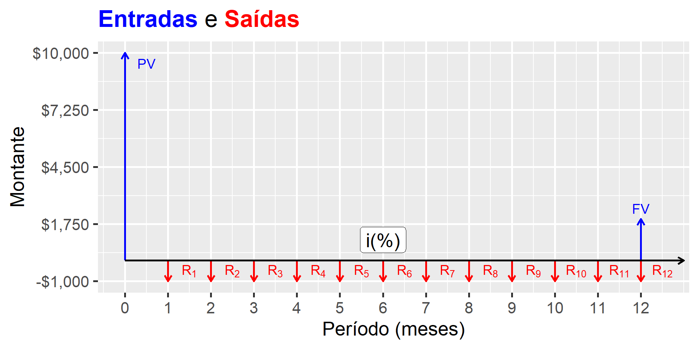
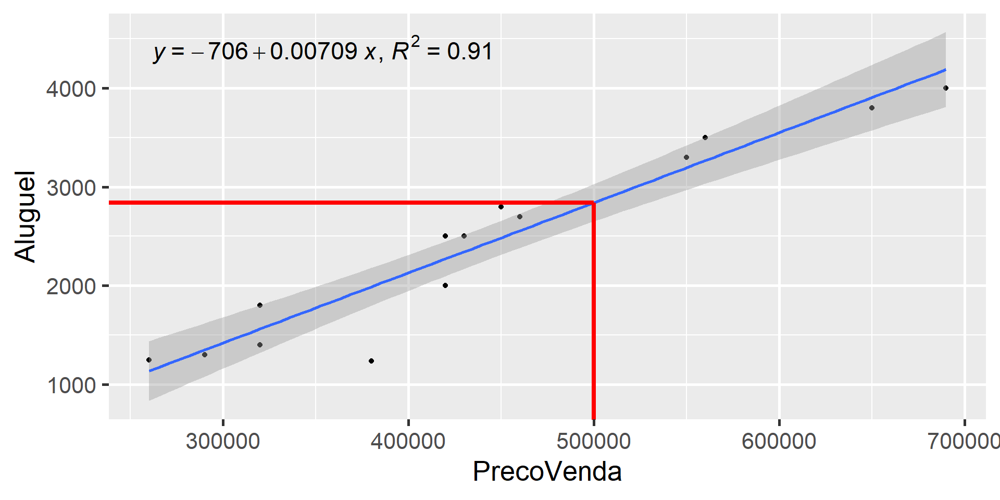

## Introdução {.smaller}

-   Aluguéis são essenciais para a compreensão do mercado imobiliário

    | Estoque          | Fluxo               |
    |------------------|---------------------|
    | Riqueza          | Renda               |
    | Dívida Pública   | Déficit Público     |
    | Ação             | Dividendo           |
    | Valor de um casa | Aluguel de uma casa |

    : Fonte: Adaptada de @Malpezzi2002TheRO.

-   Relação entre Estoque e Fluxo:

. . .


::: {.cell}

:::

::: {.cell}
::: {.cell-output-display}
{#fig-FC width=50%}
:::
:::


## Essencial de Matemática Financeira {.smaller}

-   Para calcular a renda (ou prestação), dada uma taxa de juros $i$:

    -   $R = PV\frac{(1+i)^n.i}{(1+i)^n-1}$ ou $R = \frac{PV.i}{1-(1+i)^{-n}}$

-   Para calcular o valor presente:

    -   $PV = R\frac{(1+i)^n-1}{(1+i)^n.i}$ ou $PV = \frac{R.(1-(1+i)^{-n})}{i}$

-   Quando são muitas as prestaçãos ($n \rightarrow \infty$):

    -   $$PV = \frac{R}{i}$$

-   Da equação acima derivam:

    -   O método da renda: $V_{imóvel} = \frac{Al}{i}$
    -   O método da remuneração do capital: $Al = V_{imóvel}.i$

-   Exemplo: $V_{imóvel} = \frac{Al}{i} = \frac{12.3000}{6\%}=\text{ R\$ } 600.000,00$ (conta de padaria!)

-   Mais preciso: $V_{imóvel} = \frac{Al}{i} = \frac{3000}{(1+6\%)^{1/12}-1}=\text{ R\$ } 616.326,40$

## CUIDADO! {.smaller}

-   Deve-se levar em conta:

    -   Taxa de Vacância
    -   Taxas de administração
    -   Impostos
    -   Compensação pela falta de liquidez
    -   Manutenção e Depreciação
    -   Valorização

-   Um método é levar em conta estas variáveis na taxa de desconto:

    | Tipo             | Terreno (% a.a.) | Benfeitorias (%a.a.) |
    |------------------|------------------|----------------------|
    | Taxa básica      | 8,00%            | 8,00%                |
    | Não-liquidez     | 1,50%            | 1,50%                |
    | Depreciação      | \-               | 1,50%                |
    | Taxa de vacância | \-               | 1,00%                |
    | Valorização      | -1,50%           | \-                   |
    | TOTAL            | 8,00%            | 12,50%               |

    : Fonte: Composição de taxas de desconto. Fonte: @damato, p. 86.

## Taxa composta

-   Uma vez obtidas as taxas de desconto para o terreno e para as benfeitorias, pode-se calcular a **taxa composta**:

    -   $i=\frac{V_T.i_T+V_B.i_B}{V_T + V_B}$

-   Com a taxa composta, os valores do terreno e do capital (benfeitorias), pode ser feito o cálculo do valor do aluguel.

-   Exemplo (adaptado de @damato, p. 87):

    -   $V_T = 250.000,00$
    -   $V_B = 450.000,00$
    -   $V_I = 795.000,00$ (Fator de Comercialização $\approx$ 14%)
    -   $i = \frac{250.000.0,08+450.000.0,125}{250.000 + 450.000} = \frac{20.000 + 56.250}{700.000} = 10,89% (a.a.)$
    -   Taxa ao mês: $i_{mensal} = (1+i_{anual})^{1/12} - 1 = 0,865\%$
    -   $Al = 795.000,00.0,865\% = \text{R\$ }6.876,75/\text{mês}$

## Método do aluguel líquido

-   Segundo @Malpezzi2002TheRO:
    -   $$V_{imovel} = \sum_{t=0}^{T}\frac{E(R_t-C_t)}{(1+i)^t} = \sum_{t=0}^{T}\frac{E(R_l)}{(1+i)^t} \approx \frac{R_l}{i}$$
-   Obs.: A valorização ($g$) pode ser levada em conta subtraindo-a da taxa de desconto [@Malpezzi2002TheRO]:
    -   $$V_{imovel} = \frac{R_l}{i-g}$$
    -   $i-g$ é chamada de taxa de capitalização, ou $c$ (cap rate)
    -   $$V_{imovel} = \frac{R_l}{c}$$

## Método do aluguel líquido {.smaller}

-   Segundo @damato, p. 100, deve-se deduzir, em média, 30% do aluguel bruto!

    -   $V_{imóvel} = \frac{Al}{i} = \frac{12.0,7.3000}{6\%}=\text{ R\$ } 420.000,00$

-   Estimando-se uma taxa de valorização de 2% a.a.:

    -   $V_{imóvel} = \frac{Al}{i} = \frac{12.0,7.3000}{6\%-2\%}=\text{ R\$ } 630.000,00$

-   Valor Presente Líquido: $$VPL = -I + \sum_{t=1}^T \frac{R_t - C_t}{(1+i)^t}$$

-   O VPL também pode ser escrito em função do Fator de Recuperação do Capital (FRC) $$VPL = -I + \frac{R}{FRC(i,T)};\qquad FRC = \frac{i.(1+i)^T}{(1+i)^T-1}$$

-   Para períodos muito longos, $FRC = i$, como já exposto!

## O investimento em imóveis {.smaller}

-   Exemplo:
    -   Dado que um apartamento está anunciado em R\$ 400.000,00
    -   Que a sua TMA é igual 10% a.a.
    -   Que o aluguel do imóvel é R\$ 3.000,00/mês
    -   Que a expectativa é que o aluguel se reajuste a uma taxa de 1,5% a.a.
    -   Que os custos são da ordem de 30% do valor do aluguel
    -   Quanto você pode pagar pelo apartamento?
-   Solução:
    -   $$FCA = \frac{8,5\%.(1+8,5\%)^{30}}{(1+8,5\%)^{30}-1} = 9,305\%$$
    -   $$VPL = -400.000 + \frac{12.(3000-900)}{9,305\%}$$
    -   $$VPL = -400.000 + 270.822,10 = -129.177,90$$
    -   R.: R\$ 270.000,00

## O investimento em imóveis {.smaller}

### A casa própria

-   Suponha que:
    -   Uma casa está anunciada por R\$ 500.000,00
    -   Você pode financiá-la, mediante entrada de 20% (R\$ 100.000)
    -   Após adquirí-la, você pagará ao banco uma parcela de R\$ 2.000,00 mensais por 30 anos
    -   O aluguel da casa é R\$ 3.000,00 mensais
    -   A sua TMA é de 10% a.a.
    -   Você compra a casa?
    -   Considere que não há valor residual e despreze os custos de manutenção da casa!
-   Solução:
    -   $$FCA = \frac{10\%.(1+10\%)^{30}}{(1+10\%)^{30}-1} = 10,61\%$$
    -   $$VPL = -100.000 + \frac{12.(3000-2000)}{10,61\%}$$
    -   $$VPL = -100.000 + \frac{12.000}{10,61\%} = -100.000 + 113.100,80 = 13.100,80$$

## O investimento em imóveis {.smaller}

### A casa própria (2)

-   Suponha que:
    -   Um terreno está anunciado por R\$ 100.000,00
    -   Você quer construir uma casa com orçamento de R\$ 400.000,00
    -   Você pode fazer ATC, mediante entrada de 20% (R\$ 100.000)
    -   Você pagará ao banco uma parcela de R\$ 4.000,00 mensais por 30 anos
    -   O aluguel de uma casa similar é R\$ 3.000,00 mensais
    -   A sua TMA é de 10% a.a.
    -   Você espera que o terreno tenha valorização real de 1% a.a.
    -   Você compra a casa?
    -   Considere que não há valor residual e despreze os custos de manutenção da casa!
-   Solução:
    -   $$FCA = \frac{10\%.(1+10\%)^{30}}{(1+10\%)^{30}-1} = 10,61\%$$
    -   $$VPL = \frac{100.000.(1+1\%)^{30}}{10,61\%} + \frac{12.(3000-4000)}{10,61\%} = 134.784,90 + \frac{-12.000}{10,61\%} = 21.684,10$$

## O investimento em imóveis

-   Deve-se levar em conta que cada pequeno ajuste, seja na taxa, seja na renda esperada, leva a grandes diferenças no valor do imóvel!
    -   Isto é esperado, porque o fluxo de caixa é muito extenso!
-   Se a sensibilidade é alta, o que isso significa?
    -   Que o risco do investimento é alto!

## Aparte: Administração de carteiras

-   No mercado de capitais existe um almoço grátis: a diversificação!

-   Sejam dois ativos, A e B:

    -   Ambos tem preço de aquisição, na data 0, igual a 100;
    -   O investidor adquire R\$ 500.000,00 em ativos, sendo 50% do ativo A e 50% do ativo B
    -   No ano 1, o ativo A valoriza 50%, enquanto o ativo B desvaloriza 50%
    -   Ao final do primeiro ano, o investidor faz o rebalanceamento da carteira
    -   No ano 2, o ativo A desvaloriza 33,333% e o ativo B valoriza 100%
    -   Calcule o valor da carteira ao fim do segundo período

## Aparte: Administração de carteiras (2)

-   Solução:

    | Período | Quant. A | Preço A | Quanto. B | Preço B | TOTAL   |
    |---------|----------|---------|-----------|---------|---------|
    | 0       | 2.500    | 100     | 2.500     | 100     | 500.000 |
    | 1       | 2.500    | 150     | 2.500     | 50      | 500.000 |
    | 2       | 1.666    | 100     | 5.000     | 100     | 666.600 |

    : Rebalanceamento de carteiras de investimento.

-   É possível fazer isto no mercado imobiliário?

    -   Não, devido aos altos custos de transação!
    -   Mercado imobiliário não é um mercado perfeito!

# Métodos

## Método da Renda


::: {.cell}
::: {.cell-output-display}

`````{=html}
<table>
<caption>Exemplo Método da Renda. Fonte: Apostila Prof. Norberto.</caption>
 <thead>
  <tr>
   <th style="text-align:right;"> Id </th>
   <th style="text-align:right;"> Área (m2) </th>
   <th style="text-align:right;"> Aluguel (R$/mês) </th>
   <th style="text-align:right;"> Preco de Venda (R$) </th>
   <th style="text-align:right;"> Vacância (%) </th>
   <th style="text-align:right;"> Despesas Operacionais (R$) </th>
  </tr>
 </thead>
<tbody>
  <tr>
   <td style="text-align:right;"> 1 </td>
   <td style="text-align:right;"> 115 </td>
   <td style="text-align:right;"> 580 </td>
   <td style="text-align:right;"> 70.000 </td>
   <td style="text-align:right;"> 7 </td>
   <td style="text-align:right;"> 110 </td>
  </tr>
  <tr>
   <td style="text-align:right;"> 2 </td>
   <td style="text-align:right;"> 154 </td>
   <td style="text-align:right;"> 640 </td>
   <td style="text-align:right;"> 80.000 </td>
   <td style="text-align:right;"> 8 </td>
   <td style="text-align:right;"> 120 </td>
  </tr>
  <tr>
   <td style="text-align:right;"> 3 </td>
   <td style="text-align:right;"> 132 </td>
   <td style="text-align:right;"> 610 </td>
   <td style="text-align:right;"> 75.000 </td>
   <td style="text-align:right;"> 8 </td>
   <td style="text-align:right;"> 125 </td>
  </tr>
  <tr>
   <td style="text-align:right;"> 4 </td>
   <td style="text-align:right;"> 105 </td>
   <td style="text-align:right;"> 550 </td>
   <td style="text-align:right;"> 71.500 </td>
   <td style="text-align:right;"> 5 </td>
   <td style="text-align:right;"> 135 </td>
  </tr>
  <tr>
   <td style="text-align:right;"> 5 </td>
   <td style="text-align:right;"> 140 </td>
   <td style="text-align:right;"> 625 </td>
   <td style="text-align:right;"> 77.000 </td>
   <td style="text-align:right;"> 7 </td>
   <td style="text-align:right;"> 120 </td>
  </tr>
  <tr>
   <td style="text-align:right;"> 6 </td>
   <td style="text-align:right;"> 135 </td>
   <td style="text-align:right;"> 630 </td>
   <td style="text-align:right;"> 71.000 </td>
   <td style="text-align:right;"> 8 </td>
   <td style="text-align:right;"> 130 </td>
  </tr>
  <tr>
   <td style="text-align:right;"> 7 </td>
   <td style="text-align:right;"> 117 </td>
   <td style="text-align:right;"> 600 </td>
   <td style="text-align:right;"> 75.000 </td>
   <td style="text-align:right;"> 6 </td>
   <td style="text-align:right;"> 130 </td>
  </tr>
</tbody>
</table>

`````

:::
:::


-   Calcular: valor de mercado de um imóvel com aluguel de R\$ 600,00.
-   Considerar:
    -   Taxa de Vacância: 7%; Despesas Operacionais: R\$ 125,00/mês

## Método da Remuneração do Capital (2) {.smaller}


::: {.cell}
::: {.cell-output-display}

`````{=html}
<table>
<caption>Exemplo Método da Renda</caption>
 <thead>
  <tr>
   <th style="text-align:right;"> Id </th>
   <th style="text-align:right;"> Área (m2) </th>
   <th style="text-align:right;"> Aluguel (R$/mês) </th>
   <th style="text-align:right;"> Preco de Venda (R$) </th>
   <th style="text-align:right;"> Vacância (R$) </th>
   <th style="text-align:right;"> Despesas Operacionais (R$) </th>
   <th style="text-align:right;"> Renda Líquida (R$) </th>
   <th style="text-align:right;"> Rentabilidade (%) </th>
  </tr>
 </thead>
<tbody>
  <tr>
   <td style="text-align:right;"> 1 </td>
   <td style="text-align:right;"> 115 </td>
   <td style="text-align:right;"> 580 </td>
   <td style="text-align:right;"> 70.000 </td>
   <td style="text-align:right;"> 40,60 </td>
   <td style="text-align:right;"> 110 </td>
   <td style="text-align:right;"> 429,40 </td>
   <td style="text-align:right;"> 0,61 </td>
  </tr>
  <tr>
   <td style="text-align:right;"> 2 </td>
   <td style="text-align:right;"> 154 </td>
   <td style="text-align:right;"> 640 </td>
   <td style="text-align:right;"> 80.000 </td>
   <td style="text-align:right;"> 51,20 </td>
   <td style="text-align:right;"> 120 </td>
   <td style="text-align:right;"> 468,80 </td>
   <td style="text-align:right;"> 0,59 </td>
  </tr>
  <tr>
   <td style="text-align:right;"> 3 </td>
   <td style="text-align:right;"> 132 </td>
   <td style="text-align:right;"> 610 </td>
   <td style="text-align:right;"> 75.000 </td>
   <td style="text-align:right;"> 48,80 </td>
   <td style="text-align:right;"> 125 </td>
   <td style="text-align:right;"> 436,20 </td>
   <td style="text-align:right;"> 0,58 </td>
  </tr>
  <tr>
   <td style="text-align:right;"> 4 </td>
   <td style="text-align:right;"> 105 </td>
   <td style="text-align:right;"> 550 </td>
   <td style="text-align:right;"> 71.500 </td>
   <td style="text-align:right;"> 27,50 </td>
   <td style="text-align:right;"> 135 </td>
   <td style="text-align:right;"> 387,50 </td>
   <td style="text-align:right;"> 0,54 </td>
  </tr>
  <tr>
   <td style="text-align:right;"> 5 </td>
   <td style="text-align:right;"> 140 </td>
   <td style="text-align:right;"> 625 </td>
   <td style="text-align:right;"> 77.000 </td>
   <td style="text-align:right;"> 43,75 </td>
   <td style="text-align:right;"> 120 </td>
   <td style="text-align:right;"> 461,25 </td>
   <td style="text-align:right;"> 0,60 </td>
  </tr>
  <tr>
   <td style="text-align:right;"> 6 </td>
   <td style="text-align:right;"> 135 </td>
   <td style="text-align:right;"> 630 </td>
   <td style="text-align:right;"> 71.000 </td>
   <td style="text-align:right;"> 50,40 </td>
   <td style="text-align:right;"> 130 </td>
   <td style="text-align:right;"> 449,60 </td>
   <td style="text-align:right;"> 0,63 </td>
  </tr>
  <tr>
   <td style="text-align:right;"> 7 </td>
   <td style="text-align:right;"> 117 </td>
   <td style="text-align:right;"> 600 </td>
   <td style="text-align:right;"> 75.000 </td>
   <td style="text-align:right;"> 36,00 </td>
   <td style="text-align:right;"> 130 </td>
   <td style="text-align:right;"> 434,00 </td>
   <td style="text-align:right;"> 0,58 </td>
  </tr>
</tbody>
</table>

`````

:::
:::


-   Rentabilidade média: 0,58% a.m.
-   Valor da Vacância: 7%\*600 = R\$ 42,00 /mês
-   Despesas: R\$ 125,00/mês
-   Renda líquida: 600-42-125 = R\$ 433,00 /mês
-   Valor do imóvel: $V_{imovel} = \frac{433}{0,58\%}=\text{R\$ }74.655,17$

## Método da Remuneração do Capital {.smaller}

-   Segundo @damato, p. 123:

. . .

> Apesar de ser método de grande aplicação, alguns estudiosos já estão percebendo a inversão "causa-efeito" da premissa de que todo imóvel vale (efeito) pela sua capacidade de produzir renda (causa). Talvez o fato de se partir do "efeito" (valor do imóvel) para se obter a "causa" (renda) conduza a resultados distorcidos da realidade, a menos que nos cálculos se apliquem múltiplos fatores corretivos; para o terreno: localização, área, testada, profundidade, formato, sub ou superaproveitamento; para a construção: áreas privativa e total, grupamento, padrão, idade, estado de conservação, distribuição entre andares e dos ambientes (layout). \[…\] Na realidade se verifica que são dois mercados diferentes, o de venda e o de locação, com tendência, comportamentos e público alvo também diversos.

-   Obs. Droubi:
    -   São dois mercados diferentes!
    -   Mas eles se equilibram!

## Método da Remuneração do Capital

-   É o inverso do método da renda [@damato, p. 95]!

. . .

> "quando usado inversamente, para fixação de aluguéis, o método denominar-se-á da remuneração dos capitais"

-   A taxa de remuneração deve ser determinada mediante pesquisa, conforme item 11.4.2 da NBR 14.653-2 [-@NBR1465302]:

. . .

> A taxa de remuneração deve ser objeto de pesquisa específica para cada caso, pois varia para cada tipo de imóvel, localização e, também ao longo do tempo, dependendo da conjuntura econômica.

## Método da Remuneração do Capital {.smaller}

-   Exemplo [@damato, 94]:

. . .


::: {.cell}
::: {.cell-output-display}

`````{=html}
<table>
<caption>Exemplo Método da Remuneração do Capital.</caption>
 <thead>
  <tr>
   <th style="text-align:right;"> Id </th>
   <th style="text-align:right;"> Preco de Venda (R$) </th>
   <th style="text-align:right;"> Aluguel (R$/mês) </th>
  </tr>
 </thead>
<tbody>
  <tr>
   <td style="text-align:right;"> 1 </td>
   <td style="text-align:right;"> 420.000 </td>
   <td style="text-align:right;"> 2.000 </td>
  </tr>
  <tr>
   <td style="text-align:right;"> 2 </td>
   <td style="text-align:right;"> 450.000 </td>
   <td style="text-align:right;"> 2.800 </td>
  </tr>
  <tr>
   <td style="text-align:right;"> 3 </td>
   <td style="text-align:right;"> 320.000 </td>
   <td style="text-align:right;"> 1.400 </td>
  </tr>
  <tr>
   <td style="text-align:right;"> 4 </td>
   <td style="text-align:right;"> 260.000 </td>
   <td style="text-align:right;"> 1.250 </td>
  </tr>
  <tr>
   <td style="text-align:right;"> 5 </td>
   <td style="text-align:right;"> 460.000 </td>
   <td style="text-align:right;"> 2.700 </td>
  </tr>
  <tr>
   <td style="text-align:right;"> 6 </td>
   <td style="text-align:right;"> 690.000 </td>
   <td style="text-align:right;"> 4.000 </td>
  </tr>
  <tr>
   <td style="text-align:right;"> 7 </td>
   <td style="text-align:right;"> 650.000 </td>
   <td style="text-align:right;"> 3.800 </td>
  </tr>
  <tr>
   <td style="text-align:right;"> 8 </td>
   <td style="text-align:right;"> 380.000 </td>
   <td style="text-align:right;"> 1.240 </td>
  </tr>
  <tr>
   <td style="text-align:right;"> 9 </td>
   <td style="text-align:right;"> 550.000 </td>
   <td style="text-align:right;"> 3.300 </td>
  </tr>
  <tr>
   <td style="text-align:right;"> 10 </td>
   <td style="text-align:right;"> 560.000 </td>
   <td style="text-align:right;"> 3.500 </td>
  </tr>
  <tr>
   <td style="text-align:right;"> 11 </td>
   <td style="text-align:right;"> 420.000 </td>
   <td style="text-align:right;"> 2.500 </td>
  </tr>
  <tr>
   <td style="text-align:right;"> 12 </td>
   <td style="text-align:right;"> 320.000 </td>
   <td style="text-align:right;"> 1.800 </td>
  </tr>
  <tr>
   <td style="text-align:right;"> 13 </td>
   <td style="text-align:right;"> 430.000 </td>
   <td style="text-align:right;"> 2.500 </td>
  </tr>
  <tr>
   <td style="text-align:right;"> 14 </td>
   <td style="text-align:right;"> 290.000 </td>
   <td style="text-align:right;"> 1.300 </td>
  </tr>
</tbody>
</table>

`````

:::
:::


## Método da Remuneração do Capital {.smaller}

-   Exemplo [@damato, 94]:

. . .


::: {.cell}
::: {.cell-output-display}

`````{=html}
<table>
<caption>Exemplo Método da Remuneração do Capital.</caption>
 <thead>
  <tr>
   <th style="text-align:right;"> Id </th>
   <th style="text-align:right;"> Preco de Venda (R$) </th>
   <th style="text-align:right;"> Aluguel (R$/mês) </th>
   <th style="text-align:right;"> Taxa Mensal (%) </th>
   <th style="text-align:right;"> Taxa Anual (%) </th>
  </tr>
 </thead>
<tbody>
  <tr>
   <td style="text-align:right;"> 1 </td>
   <td style="text-align:right;"> 420.000 </td>
   <td style="text-align:right;"> 2.000 </td>
   <td style="text-align:right;"> 0,48 </td>
   <td style="text-align:right;"> 5,87 </td>
  </tr>
  <tr>
   <td style="text-align:right;"> 2 </td>
   <td style="text-align:right;"> 450.000 </td>
   <td style="text-align:right;"> 2.800 </td>
   <td style="text-align:right;"> 0,62 </td>
   <td style="text-align:right;"> 7,73 </td>
  </tr>
  <tr>
   <td style="text-align:right;"> 3 </td>
   <td style="text-align:right;"> 320.000 </td>
   <td style="text-align:right;"> 1.400 </td>
   <td style="text-align:right;"> 0,44 </td>
   <td style="text-align:right;"> 5,38 </td>
  </tr>
  <tr>
   <td style="text-align:right;"> 4 </td>
   <td style="text-align:right;"> 260.000 </td>
   <td style="text-align:right;"> 1.250 </td>
   <td style="text-align:right;"> 0,48 </td>
   <td style="text-align:right;"> 5,92 </td>
  </tr>
  <tr>
   <td style="text-align:right;"> 5 </td>
   <td style="text-align:right;"> 460.000 </td>
   <td style="text-align:right;"> 2.700 </td>
   <td style="text-align:right;"> 0,59 </td>
   <td style="text-align:right;"> 7,28 </td>
  </tr>
  <tr>
   <td style="text-align:right;"> 6 </td>
   <td style="text-align:right;"> 690.000 </td>
   <td style="text-align:right;"> 4.000 </td>
   <td style="text-align:right;"> 0,58 </td>
   <td style="text-align:right;"> 7,18 </td>
  </tr>
  <tr>
   <td style="text-align:right;"> 7 </td>
   <td style="text-align:right;"> 650.000 </td>
   <td style="text-align:right;"> 3.800 </td>
   <td style="text-align:right;"> 0,58 </td>
   <td style="text-align:right;"> 7,25 </td>
  </tr>
  <tr>
   <td style="text-align:right;"> 8 </td>
   <td style="text-align:right;"> 380.000 </td>
   <td style="text-align:right;"> 1.240 </td>
   <td style="text-align:right;"> 0,33 </td>
   <td style="text-align:right;"> 3,99 </td>
  </tr>
  <tr>
   <td style="text-align:right;"> 9 </td>
   <td style="text-align:right;"> 550.000 </td>
   <td style="text-align:right;"> 3.300 </td>
   <td style="text-align:right;"> 0,60 </td>
   <td style="text-align:right;"> 7,44 </td>
  </tr>
  <tr>
   <td style="text-align:right;"> 10 </td>
   <td style="text-align:right;"> 560.000 </td>
   <td style="text-align:right;"> 3.500 </td>
   <td style="text-align:right;"> 0,62 </td>
   <td style="text-align:right;"> 7,76 </td>
  </tr>
  <tr>
   <td style="text-align:right;"> 11 </td>
   <td style="text-align:right;"> 420.000 </td>
   <td style="text-align:right;"> 2.500 </td>
   <td style="text-align:right;"> 0,60 </td>
   <td style="text-align:right;"> 7,38 </td>
  </tr>
  <tr>
   <td style="text-align:right;"> 12 </td>
   <td style="text-align:right;"> 320.000 </td>
   <td style="text-align:right;"> 1.800 </td>
   <td style="text-align:right;"> 0,56 </td>
   <td style="text-align:right;"> 6,96 </td>
  </tr>
  <tr>
   <td style="text-align:right;"> 13 </td>
   <td style="text-align:right;"> 430.000 </td>
   <td style="text-align:right;"> 2.500 </td>
   <td style="text-align:right;"> 0,58 </td>
   <td style="text-align:right;"> 7,20 </td>
  </tr>
  <tr>
   <td style="text-align:right;"> 14 </td>
   <td style="text-align:right;"> 290.000 </td>
   <td style="text-align:right;"> 1.300 </td>
   <td style="text-align:right;"> 0,45 </td>
   <td style="text-align:right;"> 5,51 </td>
  </tr>
</tbody>
</table>

`````

:::
:::


## Método da Remuneração do Capital {.smaller}

-   Determinação da taxa média:

. . .


::: {.cell}

```{.r .cell-code}
t.test(df$TaxaAnual, conf.level = .80)
```

::: {.cell-output .cell-output-stdout}

```

	One Sample t-test

data:  df$TaxaAnual
t = 22.276, df = 13, p-value = 9.712e-12
alternative hypothesis: true mean is not equal to 0
80 percent confidence interval:
 6.230468 7.034485
sample estimates:
mean of x 
 6.632477 
```


:::
:::


-   Taxa média: 6,63% \[6,23%; 7,03%\] a.a.

-   Imagine-se que agora pretenda-se avaliar um imóvel de valor de venda igual a R\$ 500.000,00

-   Adotando-se a taxa de remuneração do capital estimada (6,63%a.a.\[6,23; 7,03\]), tem-se:

    -   $Al =500.000.6,63\%/12 \approx$ R\$ 2.750,00/mês
    -   $Al =500.000.6,23\%/12 \approx$ R\$ 2.600,00/mês
    -   $Al =500.000.7,03\%/12 \approx$ R\$ 2.900,00/mês

-   O valor locativo estimado, portanto, é de R\$ 2.750,00 \[2.600,00; 2.900,00\]

## CUIDADO! {.smaller}

-   Em uma perícia, faça isto:

. . .


::: {.cell}

```{.r .cell-code}
t.test(df$TaxaMensal, conf.level = .80)
```

::: {.cell-output .cell-output-stdout}

```

	One Sample t-test

data:  df$TaxaMensal
t = 22.808, df = 13, p-value = 7.196e-12
alternative hypothesis: true mean is not equal to 0
80 percent confidence interval:
 0.5044509 0.5679332
sample estimates:
mean of x 
0.5361921 
```


:::
:::


-   Adotando-se a taxa de remuneração do capital estimada (0,54%a.a.\[0,50; 0,57\]), tem-se:
    -   $Al =500.000.0,54\% \approx$ R\$ 2.700,00/mês
    -   $Al =500.000.0,50\% \approx$ R\$ 2.500,00/mês
    -   $Al =500.000.0,57\% \approx$ R\$ 2.850,00/mês
-   O valor locativo estimado, portanto, é de R\$ 2.700,00 \[2.500,00; 2.800,00\]

## Método da Remuneração do Capital

-   Mesmos dados de @damato, p. 94:

. . .


::: {.cell}
::: {.cell-output-display}
{width=70%}
:::
:::


. . .


::: {.cell}

```{.r .cell-code}
fit <- lm(Aluguel ~ PrecoVenda, data = df)
predict(fit, newdata = list(PrecoVenda = 500000), interval = "confidence", level = .80)
```

::: {.cell-output .cell-output-stdout}

```
       fit      lwr      upr
1 2840.258 2723.016 2957.501
```


:::
:::


## Método da Remuneração do Capital

-   Mesmos dados de @damato, p. 94:

. . .


::: {.cell}
::: {.cell-output-display}
{width=70%}
:::
:::


. . .


::: {.cell}

```{.r .cell-code}
fit <- lm(Aluguel ~ PrecoVenda - 1, data = df)
predict(fit, newdata = list(PrecoVenda = 500000), interval = "confidence", level = .80)
```

::: {.cell-output .cell-output-stdout}

```
       fit      lwr      upr
1 2808.721 2672.885 2944.557
```


:::
:::


## Referências
