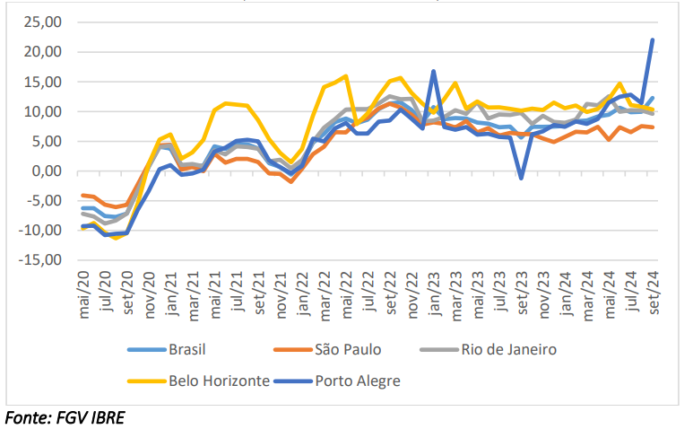

## Aproveitamento do Terreno {.smaller}

-   Uma questão que aparece em decorrência da aplicação do método evolutivo

-   Não é incomum que um imóvel seja alugado enquanto ocupando um terreno de forma "improdutiva"

    -   Exemplos:
        -   Um terreno de grandes dimensões (em planta), porém ocupado apenas em parte
        -   Um terreno edificado com um prédio comercial de 3 andares, situado em zona urbana com possibilidade de construção de até 5 andares

-   Como o terreno encontra-se subaproveitado, não se pode aplicar uma taxa de remuneração sobre todo o terreno para calcular o aluguel justo ao locatário

    -   Se o terreno é subaproveitado, quem deve arcar com a perda de renda decorrente deste subaproveitamento é o proprietário do terreno.

-   Cuidado:

    -   O aproveitamento máximo do terreno está **eventualmente** ligado ao **aproveitamento máximo legal**, *i.e.* ao que se permite construir no terreno segundo o zoneamento municipal.
    -   O aproveitamento máximo do terreno, porém, **também** está ligado ao **aproveitamento máximo econômico** do terreno.

-   Por exemplo: regiões pouco desenvolvidas, onde, até pelo baixo preço dos terrenos, não se justifica economicamente a construção de prédios de vários pavimentos, apesar de ser permitida pela legislação.

## Aproveitamento do Terreno {.smaller}

-   O coeficiente de aproveitamento do terreno é o coeficiente que relaciona as benfeitorias realmente existentes no terreno às benfeitorias que, caso erigidas no terreno, dariam-lhe o **máximo e melhor aproveitamento**.

-   O coeficiente de aproveitamento trata, portanto, não apenas da quantidade de **área construída** no terreno, mas à **qualidade** desta área construída e a sua **idade** (conservação).

. . .

> Em regiões onde os terrenos são extremamente valiosos, para que a construção lhes dê um bom aproveitamento, não basta que seja grande. É necessário que seja de padrão condizente com o mercado local, pois, ao se propor a pagar uma quantia extremamente alta por um terreno, o investidor o faz pensando em nele implantar uma construção de alto padrão, ou seja, economicamente adequada ao valor do terreno. Exemplo flagrante dessa situação é o caso da Avenida Paulista, em São Paulo, onde os preços de terrenos chegam à casa dos 10 mil dólares o metro quadrado e onde a ocupação é de prédios novos e de altíssimo padrão (Candeloro, n.d., 45).

## Cálculo do Coeficiente de Aproveitamento

-   O coeficiente de aproveitamento pode ser descrito pela fórmula a seguir (Candeloro, n.d., 19; D’Amato e Alonso 2019, p, 129):
    -   $$C_A = \frac{A_{h-existente}}{A_{h-máxima}}$$
-   Deve-se notar que o Coeficiente de Aproveitamento é calculado com áreas homogeneizadas, *i.e.* com áreas ponderadas conforme a escolha de pesos convenientes.
    -   Ponderar a área edificada segundo o aproveitamento do terreno (zoneamento)
    -   Ponderar a área edificada segundo a qualidade da área construída (CUB)
    -   Ponderar a área edificada segundo o grau de obsolescência da edificação

## Cálculo do Coeficiente de Aproveitamento {.smaller}

- Exemplo:
  - Um terreno com 10,0m de testada e área $S = 400m^2$, situado em zona urbana 
  com Taxa de Ocupação (TO) igual a 0,5 e Coeficiente de Aproveitamento (CA) 
  igual a 1,0. Este terreno encontra-se em zona com valor do metro quadrado 
  $q_T = 2.000,00 /m^2$
  - Neste terreno encontra-se edificada uma edificação comercial com 450m2 de 
  área construída, sendo 150m2 no térreo e 300m2 nos andares superiores
  - A edificação possui padrão construtivo médio e tem idade de aproximadamente 
  10 anos, o que resulta num fator de obsolescência igual a 0,75.
  - Considerar que o custo de construção equivale a 1,2 vezes o CUB do padrão
  R-8N ($\text{R\$ }1.000,00/m^2$), *i.e.* $q_B = 1,2.\text{R-8N}$.
  - Considerar que as áreas do térreo (lojas) tem peso 3 em relação às áreas superiores
    - Calcular o Coeficiente de Aproveitamento do Terreno
    - Após, calcular o valor do aluguel justo do terreno, considerando $i = 8\%$,
    tanto para as benfeitorias, tanto para o terreno.

## Resolução {.smaller}

### Cálculo do Coeficiente de Aproveitamento

:::: {.columns}

::: {.column width="50%"}
- Área homogeneizada existente
  - Térreo (peso 3):
    - $A_{T-exist} = W_T.A_T = 3.150$
    - $A_{T-exist} = 450m^2$
  - Superiores (peso 1):
    - $A_{S-exist} = W_S.A_S = 1.300$
    - $A_{S-exist} = 300m^2$
:::

::: {.column width="50%"}
- Área homogeneizada máxima
  - Térreo (peso 3):
    - $A_{T-max} = TO.S.W_T = 0,5.400.3 = 600m^2$
  - Superiores (peso 1):
    - $A_{S-max} = (CA-TO).S.W_S = (1-0,5).400.1$
    - $A_{S-max} = 200m^2$
:::

::::

- Coeficiente de Aproveitamento:
  - $CA = \frac{A_{h-existente}}{A_{h-máxima}}=\frac{750}{800}=0,9375$

## Resolução {.smaller}

### Cálculo do valor do capital

:::: {.columns}

::: {.column width="50%"}
- Capital Terreno: 
  - $q_T = \text{R\$ }2.000,00/m^2$
  - $V_T = q_T.S = 2.000.400 = 800.000$
:::


::: {.column width="50%"}
- Capital Benfeitoria:
  - $q_B = \text{R\$ }1.200,00/m^2$
  - $f_o = 0,75$
  - $V_B = f_o.q_B.A_B = 0,75.1.200.450 = 405.000$
:::

::::


### Método da Remuneração do Capital

:::: {.columns}

::: {.column width="50%"}
- Capital Terreno: 
  - $C_T = V_T.\text{CA} = 800.000.0,9375$
  - $C_T =\text{R\$ }750.000,00$
:::


::: {.column width="50%"}
- Capital Benfeitoria:
  - $C_B = V_B = \text{R\$ }405.000$
:::
::::

- $$Al = \frac{(CT + CB).i}{12}={(750.000+405.000).8\%}{12}=\text{R\$}7.700,00/mês$$

- Melhor: $Al = 1.155.000∗[(1+8\%)^{1/12}−1]=\text{R\$}7.431,30/mês$

## Coeficiente de Aproveitamento

### Redução do Coeficiente pela idade

- Com o aumento da idade da edificação, as benfeitorias podem passar a não 
refletir mais o aproveitamento máximo do terreno;

- É controverso se a idade deveria influenciar no cálculo do aproveitamento para
fins de locação (para fins de venda, é unânime que sim)
- Cuidado: os textos encontrados não mencionam, porém o avaliador deve observar 
o entorno do avaliando
  - Se no entorno, os elementos amostrais coletados possuem idade aparente 
  similar ao do avaliando, não há qualquer razão que indique o subaproveitamento 
  do terreno
  - Se, no entanto, o avaliando encontra-se em meio a diversos edifícios mais 
  novos, é indicativo que deve ser aplicada a redução do Coeficiente pela idade
  
## Coeficiente de Aproveitamento {.smaller}

### Redução do Coeficiente pela idade

-  Fórmula de Dante Guerrero [@candeloro, p. 20]:
  - $CA_R = CA\left [R + (1-R).\frac{v}{V}\right ]$
  - $R$: residual da construção
  - $v$: idade aparente da benfeitoria
  - $V$: vida útil da benfeitoria
  
- Exemplo:
  - Mesmo caso anterior, em que $CA = 750/800 = 0,9375$, considerar vida útil 
  igual a 50 anos e Residual igual a 20%:
    - $CA_R = CA\left [R + (1-R).\frac{v}{V}\right ]$
    - $CA = \frac{750}{800}\left [20\% + (1-20\%).\frac{10}{50}\right ] = 0,9375.(0,2+(1-0,2).10/50)$
    - $CA = 0,3375$
    - Está incorreto!
    - Correto seria: $CA_R = CA\left [R + (1-R).\left (1-\frac{v}{V}\right )\right ] = \frac{750}{800}\left [20\% + (1-20\%).\left(1-\frac{10}{50}\right)\right ]$
    $CA = 0,9375.(0,2+0,64) = 0,7875$
  
## Coeficiente de Aproveitamento {.smaller}

### Redução do Coeficiente pela idade

-  Cuidado com a aplicação de fórmulas prontas!

- Exemplo [@alonso2017, p. 4-5]:
  - Suponhamos então que determinado terreno avaliando, com 2.304,00m2,
  situado em região onde a lei de uso e ocupação do solo fixa o coeficiente de
  aproveitamento 2 e taxa de ocupação 0,50, e que esteja ocupado por uma
  construção térrea com 22 anos de idade, vida útil de 60 anos e 700,00m2 de 
  área construída total; as áreas ponderadas "existente" e "possível" são assim
  calculadas:
    - $A_{h-existente} = 700\times3,0 = 2.100,00m^2$
    - $A_{h-possível} = 2.304\times0,5\times3,0 +  2.304\times0,5\times2,0 + 2\times2.304\times0,5\times1,0= 8.064,00m^2$
    - O que seria o $CA_{básico}$?
    - $CA_{básico} = \frac{2.100}{8.064}=0,26$
    - Aplicou-se $C_{Ap} = 1 – [((E – e)/E).(0,20 + (0,80.(V – v)/V))]$
    - E chegou-se a: $C_{Ap} =  = 1 – [((8.064 – 2.100)/8.064) (0,20 + (0,80.(60-22)/60))] = 1 – (0,7396 . 0,7067) = 0,477$
    - O coeficiente de aproveitamento aumentou após a consideração da idade!!!
    - Pode-se perceber que o erro está no componente básico da fórmula!
    - Correto seria: $C_{Ap} = 1 – [ (e/E) . ( 0,20 + ( 0,80 . (V – v)/V))] = 1 – (0,26 . 0,7067) = 0,184$
    
## Coeficiente de Aproveitamento {.smaller}

### Redução do Coeficiente pela idade e padrão  

> De fato, como explicar a ocorrência de demolição de imóveis antes de
atingirem sua vida útil? Geralmente isto acontece quando ocorre alteração
ponderável do padrão em determinada região tornando as construções ali
existentes obsoletas funcionalmente [@alonso2017, p. 5].

> Então, aos dois fatores endógenos (área e idade) deve ser acrescentado
o padrão regional, de natureza exógena, portanto de caráter somatório 
[@alonso2017, p. 6].

- $$C_{Ap} = 1 – (1 - \frac{e}{E}).(0,20 + (0,80.(1 - v/V))) + (1 - p/P)$$

- Exemplo [@alonso2017, p. 6-8]:
  - Mesmos dados do anterior
  - Porém, agora considerando que o padrão da construção existente é de 
  1,470xR-8N, enquanto no entorno prevalece um padrão mais alto, de 1,926xR-8N
  
## Coeficiente de Aproveitamento {.smaller}

### Redução do Coeficiente pela idade e padrão  

- Solução [@alonso2017, p. 8]:
  - $C_{Ap} = 0,714$
  - Não faz o menor sentido!
  
- Solução lógica:
  - $C_{Ap} = 1 – [ (e/E) . (0,20 + (0,80.(V – v)/V)).(p/P)] = 1 – (0,26.0,7067.0.763) = 0,184$

- Não faz sentido, ao meu ver, que a variável padrão seja considerada na forma
aditiva, enquanto as outras são consideradas na forma multiplicativa.

# Método Comparativo

## O Método Comparativo {.smaller}

-   O Método Comparativo Direto de Dados de Mercado (MCDDM) tenta contornar a 
necessidade de estabelecimento de uma taxa de remuneração do capital, através da
pesquisa direta de dados de mercado de aluguéis de imóveis com diferentes 
características

. . . 


::: {.cell}
::: {.cell-output-display}


| id|   Area| Aluguel| Condo|Padrao | PadraoProxy| Idade|
|--:|------:|-------:|-----:|:------|-----------:|-----:|
|  1|  90.00|    2755|   285|Alto   |       2.160|    25|
|  2|  87.00|    2310|   285|Médio  |       1.926|    25|
|  3|  90.00|    2215|   230|Alto   |       2.160|    30|
|  4|  95.00|    1830|   230|Baixo  |       1.692|    30|
|  5|  90.00|    2000|   230|Alto   |       2.160|    30|
|  6| 105.00|    1830|   290|Médio  |       1.926|    25|
|  7| 100.00|    1640|   250|Baixo  |       1.692|    30|
|  8|  93.69|      NA|   250|Alto   |       1.926|    25|


:::
:::


## O Método Comparativo {.smaller}

## Análise Exploratória


::: {.cell}

:::

::: {.cell}
::: {.cell-output-display}
{width=960}
:::
:::


## O Método Comparativo {.smaller}

## Análise Exploratória


::: {.cell}
::: {.cell-output-display}
{width=960}
:::
:::


## O Método Comparativo {.smaller}

## Análise Exploratória


::: {.cell}
::: {.cell-output-display}
{width=960}
:::
:::


## O Método Comparativo {.smaller}

## Análise de regressão


::: {.cell}
::: {.cell-output-display}


|term              |  estimate| std.error| statistic|   p.value|
|:-----------------|---------:|---------:|---------:|---------:|
|(Intercept)       | 13.128778| 2.5302474|  5.188733| 0.0065668|
|log(Area)         | -2.205286| 0.5582370| -3.950448| 0.0168117|
|log(PadraoDeprec) |  0.768293| 0.2693386|  2.852518| 0.0462779|


:::
:::


## O Método Comparativo {.smaller}

## Análise de regressão


::: {.cell}
::: {.cell-output-display}
{width=960}
:::
:::


## O Método Comparativo {.smaller}

## Previsão de Valores


::: {.cell}
::: {.cell-output .cell-output-stdout}

```
       fit      lwr      upr
1 22.96763 21.73908 24.26562
```


:::
:::


## O Método Comparativo {.smaller}

## Alternativa (não-recomendado!)


::: {.cell}
::: {.cell-output-display}
{width=960}
:::
:::


## O Método Comparativo {.smaller}

## Alternativa


::: {.cell}

```{.r .cell-code}
.246*93.69*1.926*(1-2.5/100)^25
```

::: {.cell-output .cell-output-stdout}

```
[1] 23.57219
```


:::
:::


# Atualização de Aluguéis

## Atualização de Aluguéis

- A existência de poucos dados de mercado contemporâneos exige que seja feita a
comparação de dados de aluguéis contratados em perídos anteriores

- Exemplo: calcular o aluguel vigente em maio/2008 [@damato, 755]

. . . 


::: {.cell}
::: {.cell-output-display}


| Id|Inicio     | Prazo| Aluguel|Reajuste |Indice |
|--:|:----------|-----:|-------:|:--------|:------|
|  1|01/03/2014 |    60|    1400|Anual    |IGP-M  |
|  2|12/06/2015 |    60|    1350|Anual    |IGP-M  |
|  3|17/08/2015 |    48|    1200|Anual    |IGP-M  |
|  4|12/09/2015 |    48|    1164|Anual    |IGP-M  |


:::
:::


## Atualização de Aluguéis

## Atualização de Aluguéis {.smaller}

- Por que sou contrário?
  - Equilíbrio dos mercados imobiliário e de ativos
  - Quando o primeiro contrato foi firmado, em março de 2014, a atividade 
econômica ainda estava acelerada (desemprego baixo, renda alta)
  - Em 2015, a Atividade Econômica já havia caído bruscamente, o que afeta o
  mercado de aluguéis.

. . . 


::: {.cell}
::: {.cell-output-display}
{width=75%}
:::
:::


# Equilíbrio dos Mercados

## Choque de demanda


::: {.cell}
::: {.cell-output-display}
![Efeito de um choque de demanda (atividade econômica). Fonte: @diPasquale [apud @ADAMS2010]](Alugueis_02_files/figure-revealjs/choqueDemanda-1.png){width=960}
:::
:::


## Efeito de um aumento da taxa de juros de longo prazo


::: {.cell}
::: {.cell-output-display}
![Efeito de um aumento de juros de longo prazo. Fonte: @diPasquale [apud @ADAMS2010]](Alugueis_02_files/figure-revealjs/choqueJuros-1.png){width=960}
:::
:::


## Efeito do aumento de custos de construção


::: {.cell}
::: {.cell-output-display}
![Efeito de um aumento de custos de construção. Fonte: @diPasquale [apud @ADAMS2010]](Alugueis_02_files/figure-revealjs/choqueCustos-1.png){width=960}
:::
:::


## Como entender o mercado imobiliário (1) {.smaller}

1. A pandemia de Covid-19 acarretou num aumento dos custos de construção, porém
os juros de longo prazo também cederam:

. . . 


::: {.cell}
::: {.cell-output-display}
{width=65%}
:::
:::


- O aumento dos custos de construção diminui o *output* do mercado de construção,
o que leva a uma diminuição do estoque, o que por sua vez aumenta o preço dos 
aluguéis.

## Como entender o mercado imobiliário (2) {.smaller}

2. Após a pandemia, os juros de longo prazo, que haviam caído, voltaram a 
elevar-se:
 
. . . 


::: {.cell}
::: {.cell-output-display}
{width=70%}
:::
:::


- O aumento dos juros de longo prazo diminue o apetite dos investidores por
imóveis e impacta o mercado de construção, o que também leva a aumento dos
aluguéis.

## Como entender o mercado imobiliário (3) {.smaller}

- Uma visão de prazo maior:

. . . 


::: {.cell}
::: {.cell-output-display}
{width=80%}
:::
:::


## Como entender o mercado imobiliário (4) {.smaller}

3. A atividade econômica vem se recuperando após o baque da pandemia de COVID-19:

. . . 


::: {.cell}
::: {.cell-output-display}
{width=80%}
:::
:::


- O aumento da atividade econômica leva ao aumento do preço dos aluguéis.

## Como entender o mercado imobiliário (5)

- Resultado:

. . . 


::: {.cell}
::: {.cell-output-display}
{width=80%}
:::
:::


## Como entender o mercado imobiliário (6)

- Para melhor compreender o slide anterior:

. . .


::: {.cell}
::: {.cell-output-display}
{width=80%}
:::
:::


## Como entender o mercado imobiliário (7)

- Visão de mais longo prazo:

. . . 


::: {.cell}
::: {.cell-output-display}
{width=80%}
:::
:::


## Referências
