# Aspectos Legais

## Lei do Inquilinato {.smaller}

-   A partir da entrada em vigor do Código Civil, em jan/1917, a legislação do inquilinato evoluindo em fases alternadas, ora favorecendo os proprietários, ora os inquilinos [@damato, p. 38].

-   Lei em vigor: a Lei nº 8.245, de 18/10/1991 é uma **lei de ordem pública**, ou seja, atinge os contratos celebrados em particulares, impedindo o estabelecimento de cláusulas contrárias aos seus dispositivos, protegendo assim a parte economicamente mais fraca.

-   Continam regulados pelo Código Civil e pelas leis especiais:

    -   As locações:
        -   de imóveis de propriedade da União, dos Estados e Municípios, de suas autarquias e fundações públicas
        -   de vagas autônomas de garagem ou de espaços para estacionamento de veículos;
        -   de espaços destinados à publicidade;
        -   em apart-hotéis, hotéis-residência ou equiparados, assim considerados aqueles que prestam serviços regulares a seus usuários e como tais sejam autorizados a funcionar;
    -   o arrendamento mercantil, em qualquer de suas modalidades

## Direito de Preferência {.smaller}

> Art. 27. No caso de venda, promessa de venda, cessão ou promessa de cessão de direitos ou dação em pagamento, o locatário tem preferência para adquirir o imóvel locado, em igualdade de condições com terceiros, devendo o locador dar - lhe conhecimento do negócio mediante notificação judicial, extrajudicial ou outro meio de ciência inequívoca. Parágrafo único. A comunicação deverá conter todas as condições do negócio e, em especial, o preço, a forma de pagamento, a existência de ônus reais, bem como o local e horário em que pode ser examinada a documentação pertinente.

> Art. 28. O direito de preferência do locatário caducará se não manifestada, de maneira inequívoca, sua aceitação integral à proposta, no prazo de trinta dias.

> Art. 29. Ocorrendo aceitação da proposta, pelo locatário, a posterior desistência do negócio pelo locador acarreta, a este, responsabilidade pelos prejuízos ocasionados, inclusive lucros cessantes.

## Direito de Preferência {.smaller}

> Art. 30. Estando o imóvel sublocado em sua totalidade, caberá a preferência ao sublocatário e, em seguida, ao locatário. Se forem vários os sublocatários, a preferência caberá a todos, em comum, ou a qualquer deles, se um só for o interessado. Parágrafo único. Havendo pluralidade de pretendentes, caberá a preferência ao locatário mais antigo, e, se da mesma data, ao mais idoso.

> Art. 31. Em se tratando de alienação de mais de uma unidade imobiliária, o direito de preferência incidirá sobre a totalidade dos bens objeto da alienação.

> Art. 32. O direito de preferência não alcança os casos de perda da propriedade ou venda por decisão judicial, permuta, doação, integralização de capital, cisão, fusão e incorporação.

## Ação Revisional de Aluguel {.smaller}

> Art. 68. Na ação revisional de aluguel, que terá o rito sumaríssimo, observar-se-á o seguinte:\
> I – além dos requisitos exigidos pelos arts. 276 e 282 do Código de Processo Civil, a petição inicial deverá indicar o valor do aluguel cuja fixação é pretendida. (Vide Nota mental na página seguinte).\
> II – ao designar a audiência de instrução e julgamento, o juiz, se houver pedido e com base nos elementos fornecidos pelo autor ou nos que indicar, fixará aluguel provisório, não excedente a oitenta por cento do pedido, que será devido desde a citação.\
> III – sem prejuízo da contestação e até a audiência, o réu poderá pedir seja revisto o aluguel provisório, fornecendo os elementos para tanto.\
> IV – na audiência de instrução e julgamento, apresentada a contestação, que deverá conter contraproposta se houver discordância quanto ao valor pretendido, o juiz tentará a conciliação e, não sendo esta possível, suspenderá o ato para a **realização de perícia**, se necessária, designando, desde logo, audiência em continuação.

## Ação Renovatória de aluguel {.smaller}

> Art. 51. Nas locações de imóveis destinados ao comércio, o locatário terá direito à renovação do contrato, por igual prazo, desde que, cumulativamente:\
> I. o contrato a renovar tenha sido celebrado por escrito e com prazo determinado;\
> II. o prazo mínimo do contrato a renovar ou a soma dos prazos ininterruptos dos contratos escritos seja de **cinco anos**; (g. n.)\
> III. o locatário esteja explorando seu comércio, no mesmo ramo, pelo prazo mínimo e ininterrupto de três anos.\
> Art. 52. O locador não estará obrigado a renovar o contrato se:\
> I – por determinação do Poder Público, tiver que realizar no imóvel obras que importarem na sua radical transformação; **ou para fazer modificação de tal natureza que aumente o valor do negócio ou da propriedade**;(g. n.)\
> II – o imóvel vier a ser utilizado por ele próprio ou para transferência de fundo de comércio existente há mais de um ano, sendo detentor da maioria do capital o locador, seu cônjuge, ascendente ou descendente.

-   Este direito de renovação pelo locatário nos contratos com prazo maior ou igual a 5 anos é que enseja a cobrança de luvas!

## Ação Renovatória de aluguel {.smaller}

### Contestação

> Art. 72. A contestação do locador, além da defesa de direito que possa caber, ficará adstrita, quanto à matéria de fato, ao seguinte:\
> ...\
> II – não atender, a proposta do locatário, o valor locativo real do imóvel na época da renovação, excluída a valorização trazida por aquele ao ponto ou lugar;\
> III – ter proposta de terceiro para a locação, em condições melhores;\
> IV – não estar obrigado a renovar a locação (incisos I e II do art. 52).\
> § 1o . No caso do inciso II, o locador deverá apresentar, em contraproposta, as condições que repute compatíveis com o valor locativo real e atual do imóvel.\
> § 2o .\
> § 3o . No caso do inciso I do art. 52, a contestação deverá trazer prova da determinação do Poder Público ou relatório pormenorizado das obras a serem realizadas e da estimativa de valorização que sofrerá o imóvel, **assinado por engenheiro devidamente habilitado**. (Grifo nosso!!)

# O Método Comparativo

## O Método Comparativo

-   O Método Comparativo Direto de Dados de Mercado (MCDDM) tenta contornar a necessidade de estabelecimento de uma taxa de remuneração do capital, através da pesquisa direta de dados de mercado de aluguéis de imóveis com diferentes características

-   O Método Comparativo é o preferido quando existem dados de comparação disponíveis contemporâneos aos do avaliando

-   É mais viável em algumas tipologias, como a de salas comercais, lojas, apartamentos, etc.

-   Pode ser utilizado o Tratamento Científico (preferencialmente) e/ou o Tratamento por Fatores

-   O Tratamento por Fatores acaba sendo bastante utilizado em algumas tipologias devido à escassez de dados.

## O Método Comparativo {.smaller}

-   Independente do tratamento, é interessante conhecer os parâmetros do IBAPE/SP para cálculo de valores de imóveis urbanos.

-   Para o IBAPE/SP:

    -   $V_I = V_T + V_B = (V_T + C_B).F_c$
        -   $V_B$ é chamado de "Valor de Venda da Benfeitoria"
    -   $V_B = \text{CUB-SP}.P_C.A_c.F_{OC}$
        -   $P_C$: Índice referente à tipologia e padrão
        -   $A_C$: Área construída da edificação
        -   $F_{OC}$: Fator de Adequação ao obsoletismo e ao estado de conservação
    -   $F_{OC} = R+K_D(1-R)$
        -   $R$: valor residual da edificiação
        -   $K_D$: coeficiente de depreciação de Ross-Heidecke
    -   $K_D = (1-E_c). \left ( 1-0,5\left (\frac{I_E}{I_R}+\frac{I_E^2}{I_R^2}\right) \right)$
        -   $I_E$: Idade da Edificação
        -   $I_R$: Idade de Referência
        -   $E_C$: Estado de Conservação (Heidecke)

## O Método Comparativo {.smaller}

-   Também é usual efetuar a depreciação pelo método do valor descrescente:
    -   $F_{OC}= (1-R)^{I_E}$
        -   $R$: Razão da Depreciação ($R = 1/I_R$)

. . . 
        
| TIPO                                                 |Vida útil | R (%) |
|------------------------------------------------------|----------|-------|
| Barracos                                             | 25       | 4,0   |
| Residência Proletário  Rústico a médio comercial     | 67       | 1,5   |
| Residências médio superior a luxo                    | 50       | 2,0   |
| Apartamentos e Escritórios                           | 40       | 40    |
| Armazéns e Indústrias                                | 67       | 67    |
| Construções de Madeira                               | 25       | 25    |

: Razões a considerar no método do valor decrescente

-   Ou pelo método da linha reta:
    -   $F_{OC}= P_R + \frac{I_R-I_E}{I_R}.P_D$
        -   $P_R$: Parcela Residual (20%)
        -   $P_D$: Parcela Depreciável (80%)
        -   $I_E$: Idade da Edificação
        -   $I_R$: Idade de Referência

## Apartamentos {.smaller}

### @damato [p. 263-264]


::: {.cell}
::: {.cell-output-display}


| id|   Area| Aluguel| Condo|Padrao | Idade|
|--:|------:|-------:|-----:|:------|-----:|
|  1|  90.00|    2755|   285|Alto   |    25|
|  2|  87.00|    2310|   285|Médio  |    25|
|  3|  90.00|    2215|   230|Alto   |    30|
|  4|  95.00|    1830|   230|Baixo  |    30|
|  5|  90.00|    2000|   230|Alto   |    30|
|  6| 105.00|    1830|   290|Médio  |    25|
|  7| 100.00|    1640|   250|Baixo  |    30|
|  8|  93.69|      NA|   250|Médio  |    25|


:::
:::


## Solução por fatores {.smaller}


::: {.cell}
::: {.cell-output-display}


| id|   Area| Aluguel| Condo|Padrao | Idade|    PU| Foferta| Farea| Fcondo| Fpadrao| Fidade|    k| Ftotal| PUhom|
|--:|------:|-------:|-----:|:------|-----:|-----:|-------:|-----:|------:|-------:|------:|----:|------:|-----:|
|  1|  90.00|    2755|   285|Alto   |    25| 27.55|     0.9|  1.04|   0.84|    0.89|   1.00| 0.53|   0.78| 21.36|
|  2|  87.00|    2310|   285|Médio  |    25| 23.90|     0.9|  1.08|   0.81|    1.00|   1.00| 0.53|   0.89| 21.30|
|  3|  90.00|    2215|   230|Alto   |    30| 22.15|     0.9|  1.04|   1.04|    0.89|   1.13| 0.47|   1.11| 24.63|
|  4|  95.00|    1830|   230|Baixo  |    30| 17.34|     0.9|  0.99|   1.10|    1.14|   1.13| 0.47|   1.36| 23.61|
|  5|  90.00|    2000|   230|Alto   |    30| 20.00|     0.9|  1.04|   1.04|    0.89|   1.13| 0.47|   1.11| 22.24|
|  6| 105.00|    1830|   290|Médio  |    25| 15.69|     0.9|  0.89|   0.97|    1.00|   1.00| 0.53|   0.86| 13.46|
|  7| 100.00|    1640|   250|Baixo  |    30| 14.76|     0.9|  0.94|   1.07|    1.14|   1.13| 0.47|   1.28| 18.86|
|  8|  93.69|      NA|   250|Médio  |    25|    NA|     0.9|  1.00|   1.00|    1.00|   1.00| 0.53|   1.00|    NA|


:::
:::


- Saneamento da amostra:

. . . 


::: {.cell}

```{.r .cell-code}
outlier_analysis(df$PUhom, criterion = "chauvenet")
```

::: {.cell-output .cell-output-stderr}

```
Step 1: removing values 13.464950972952
```


:::

::: {.cell-output .cell-output-stdout}

```
[1] 21.35982 21.30265 24.62557 23.60608 22.23527 18.85587
```


:::
:::


- PU médio homogeneizado: R$ 22,00$/m^2$

## Apartamentos {.smaller}

### Análise Exploratória


::: {.cell}
::: {.cell-output-display}
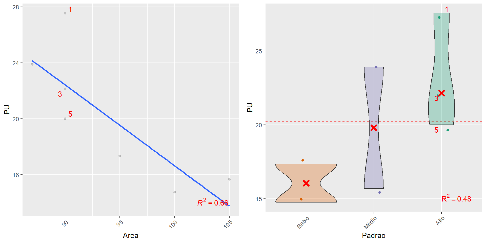{width=960}
:::
:::


## Apartamentos {.smaller}

### Análise de regressão


::: {.cell}
::: {.cell-output-display}

`````{=html}
<table style="NAborder-bottom: 0;">
 <thead>
  <tr>
   <th style="text-align:left;"> term </th>
   <th style="text-align:right;"> estimate </th>
   <th style="text-align:right;"> std.error </th>
   <th style="text-align:right;"> statistic </th>
   <th style="text-align:right;"> p.value </th>
  </tr>
 </thead>
<tbody>
  <tr>
   <td style="text-align:left;"> (Intercept) </td>
   <td style="text-align:right;"> 64.67 </td>
   <td style="text-align:right;"> 21.73 </td>
   <td style="text-align:right;"> 2.98 </td>
   <td style="text-align:right;"> 0.06 </td>
  </tr>
  <tr>
   <td style="text-align:left;"> Area </td>
   <td style="text-align:right;"> -0.46 </td>
   <td style="text-align:right;"> 0.24 </td>
   <td style="text-align:right;"> -1.91 </td>
   <td style="text-align:right;"> 0.15 </td>
  </tr>
  <tr>
   <td style="text-align:left;"> PadraoBaixo </td>
   <td style="text-align:right;"> -3.73 </td>
   <td style="text-align:right;"> 3.42 </td>
   <td style="text-align:right;"> -1.09 </td>
   <td style="text-align:right;"> 0.35 </td>
  </tr>
  <tr>
   <td style="text-align:left;"> PadraoMédio </td>
   <td style="text-align:right;"> -0.68 </td>
   <td style="text-align:right;"> 3.24 </td>
   <td style="text-align:right;"> -0.21 </td>
   <td style="text-align:right;"> 0.85 </td>
  </tr>
</tbody>
<tfoot>
<tr><td style="padding: 0; " colspan="100%"><span style="font-style: italic;">Note: </span></td></tr>
<tr><td style="padding: 0; " colspan="100%">
<sup></sup> Erro-padrão dos resíduos:  3,18  em  3  graus de liberdade.</td></tr>
<tr><td style="padding: 0; " colspan="100%">
<sup>a</sup> R2:  0,77</td></tr>
<tr><td style="padding: 0; " colspan="100%">
<sup>b</sup> R2ajustado:  0,53</td></tr>
<tr><td style="padding: 0; " colspan="100%">
<sup>c</sup> RMSE:  2,08</td></tr>
</tfoot>
</table>

`````

:::
:::


## Apartamentos {.smaller}

### Análise de regressão


::: {.cell}
::: {.cell-output-display}
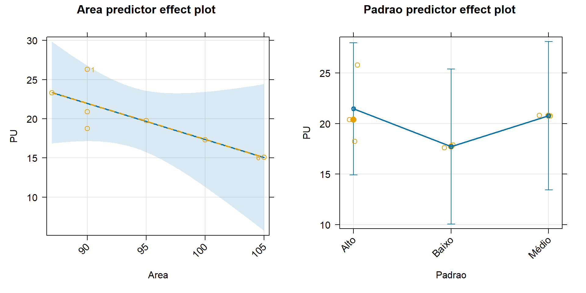{width=960}
:::
:::


## Apartamentos {.smaller}

### Previsão de Valores


::: {.cell}
::: {.cell-output .cell-output-stdout}

```
       fit      lwr      upr
1 20.85465 17.06326 24.64605
```


:::
:::


## Apartamentos {.smaller}

### Alternativa (não-recomendado!)


::: {.cell}
::: {.cell-output-display}
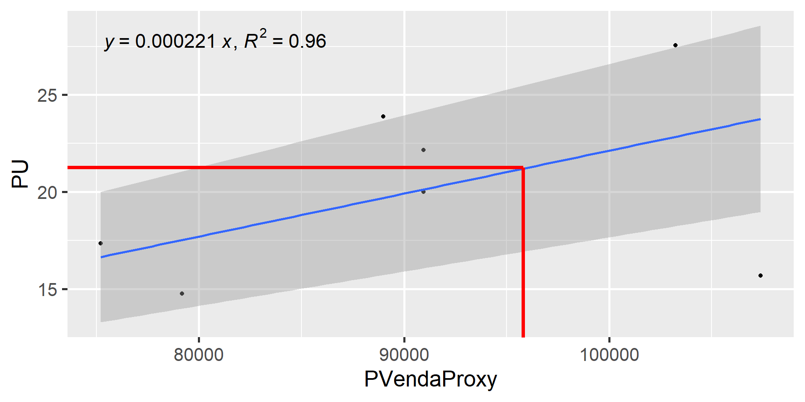{width=960}
:::
:::


## Apartamentos {.smaller}

### Alternativa


::: {.cell}
::: {.cell-output-display}

`````{=html}
<table style="NAborder-bottom: 0;">
 <thead>
  <tr>
   <th style="text-align:left;"> term </th>
   <th style="text-align:right;"> estimate </th>
   <th style="text-align:right;"> std.error </th>
   <th style="text-align:right;"> statistic </th>
   <th style="text-align:right;"> p.value </th>
  </tr>
 </thead>
<tbody>
  <tr>
   <td style="text-align:left;"> (Intercept) </td>
   <td style="text-align:right;"> 21.244 </td>
   <td style="text-align:right;"> 0.821 </td>
   <td style="text-align:right;"> 25.886 </td>
   <td style="text-align:right;"> 0.000 </td>
  </tr>
  <tr>
   <td style="text-align:left;"> I(Area - 93.7) </td>
   <td style="text-align:right;"> -0.623 </td>
   <td style="text-align:right;"> 0.124 </td>
   <td style="text-align:right;"> -5.016 </td>
   <td style="text-align:right;"> 0.007 </td>
  </tr>
  <tr>
   <td style="text-align:left;"> I(PVendaProxy - 95821.93) </td>
   <td style="text-align:right;"> 0.000 </td>
   <td style="text-align:right;"> 0.000 </td>
   <td style="text-align:right;"> 2.739 </td>
   <td style="text-align:right;"> 0.052 </td>
  </tr>
</tbody>
<tfoot>
<tr><td style="padding: 0; " colspan="100%"><span style="font-style: italic;">Note: </span></td></tr>
<tr><td style="padding: 0; " colspan="100%">
<sup></sup> Erro-padrão dos resíduos:  1,96  em  4  graus de liberdade.</td></tr>
<tr><td style="padding: 0; " colspan="100%">
<sup>a</sup> R2:  0,88</td></tr>
<tr><td style="padding: 0; " colspan="100%">
<sup>b</sup> R2ajustado:  0,82</td></tr>
<tr><td style="padding: 0; " colspan="100%">
<sup>c</sup> RMSE:  1,49</td></tr>
</tfoot>
</table>

`````

:::
:::


## Apartamentos {.smaller}

### Análise de regressão


::: {.cell}
::: {.cell-output-display}
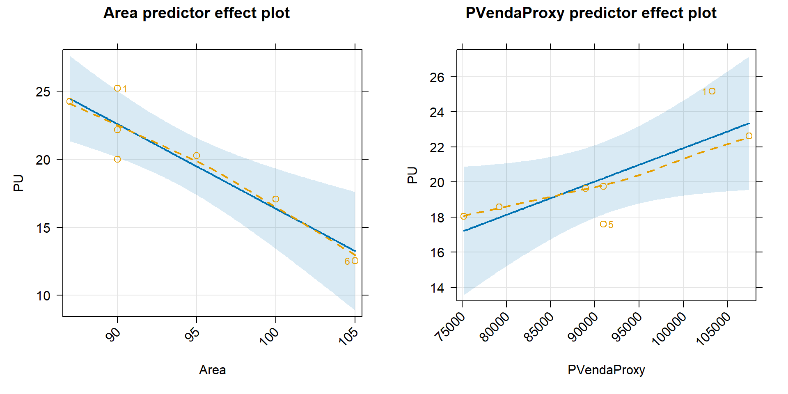{width=960}
:::
:::


## Apartamentos (2) {.smaller .scrollable}

### @damato [p. 372]


::: {.cell}
::: {.cell-output-display}


|Id   | Aluguel (R$)| Venda (R$)| Área Útil (m2)| Condomínio (R$)| Local|Padrao   | Idade| Vida útil|Conservação     |
|:----|------------:|----------:|--------------:|---------------:|-----:|:--------|-----:|---------:|:---------------|
|1    |        2.000|    420.000|             70|             380|   796|Superior |     0|        60|Novo            |
|2    |        2.800|    450.000|             81|             420|   796|Superior |    10|        60|Reparos simples |
|3    |        1.400|    320.000|             64|             450|   796|Medio    |    25|        60|Reparos simples |
|4    |        1.250|    260.000|             55|             499|   796|Medio    |    20|        60|Reparos simples |
|5    |        2.700|    460.000|             81|             530|   788|Superior |    10|        60|Reparos simples |
|6    |        4.000|    690.000|            113|             450|   788|Fino     |     0|        50|Novo            |
|7    |        3.800|    650.000|            113|             450|   788|Fino     |     0|        50|Novo            |
|8    |        1.240|    380.000|             72|             498|   805|Medio    |    20|        60|Reparos simples |
|9    |        3.300|    550.000|             83|             550|   761|Superior |    10|        60|Reparos simples |
|10   |        3.500|    560.000|             83|             550|   761|Superior |    10|        60|Reparos simples |
|11   |        2.500|    420.000|             72|             350|   761|Superior |     5|        60|Reparos simples |
|12   |        1.800|    320.000|             60|             481|   796|Medio    |    10|        60|Reparos simples |
|13   |        2.500|    430.000|             85|             400|   796|Superior |    10|        60|Regular         |
|14   |        1.300|    290.000|             53|             500|   766|Medio    |    10|        60|Reparos simples |
|aval |           NA|         NA|             78|             497|   796|Superior |    15|        60|Reparos simples |


:::
:::


## Apartamentos (2) {.smaller}


::: {.cell}
::: {.cell-output-display}


|Elemento | Aluguel|   Venda| AreaUtil| Condominio| Local|Padrao   | Idade| VidaUtil|Conservacao     | PadraoProxy| Condo|    PU|  Foc|    k|    C| FFoc| FPadrao| FLocal| FCondo| FArea| SumFatores| PUhom|
|:--------|-------:|-------:|--------:|----------:|-----:|:--------|-----:|--------:|:---------------|-----------:|-----:|-----:|----:|----:|----:|----:|-------:|------:|------:|-----:|----------:|-----:|
|1        |   2.000| 420.000|       70|        380|   796|Superior |     0|       60|Novo            |        2,41|  5,43| 25,71| 1,00| 1,00| 0,00| 0,75|    1,00|   1,00|   1,17|  1,11|       1,04| 26,76|
|2        |   2.800| 450.000|       81|        420|   796|Superior |    10|       60|Reparos simples |        2,41|  5,19| 31,11| 0,79| 0,74| 0,18| 0,95|    1,00|   1,00|   1,23|  0,96|       1,14| 35,55|
|3        |   1.400| 320.000|       64|        450|   796|Medio    |    25|       60|Reparos simples |        1,93|  7,03| 19,69| 0,66| 0,58| 0,18| 1,14|    1,25|   1,00|   0,91|  1,22|       1,51| 29,76|
|4        |   1.250| 260.000|       55|        499|   796|Medio    |    20|       60|Reparos simples |        1,93|  9,07| 20,45| 0,71| 0,64| 0,18| 1,06|    1,25|   1,00|   0,70|  1,42|       1,43| 29,26|
|5        |   2.700| 460.000|       81|        530|   788|Superior |    10|       60|Reparos simples |        2,41|  6,54| 30,00| 0,79| 0,74| 0,18| 0,95|    1,00|   1,01|   0,97|  0,96|       0,90| 26,94|
|6        |   4.000| 690.000|      113|        450|   788|Fino     |     0|       50|Novo            |        3,07|  3,98| 31,86| 1,00| 1,00| 0,00| 0,75|    0,78|   1,01|   1,60|  0,69|       0,84| 26,69|
|7        |   3.800| 650.000|      113|        450|   788|Fino     |     0|       50|Novo            |        3,07|  3,98| 30,27| 1,00| 1,00| 0,00| 0,75|    0,78|   1,01|   1,60|  0,69|       0,84| 25,35|
|8        |   1.240| 380.000|       72|        498|   805|Medio    |    20|       60|Reparos simples |        1,93|  6,92| 15,50| 0,71| 0,64| 0,18| 1,06|    1,25|   0,99|   0,92|  1,08|       1,30| 20,20|
|9        |   3.300| 550.000|       83|        550|   761|Superior |    10|       60|Reparos simples |        2,41|  6,63| 35,78| 0,79| 0,74| 0,18| 0,95|    1,00|   1,05|   0,96|  0,94|       0,90| 32,15|
|10       |   3.500| 560.000|       83|        550|   761|Superior |    10|       60|Reparos simples |        2,41|  6,63| 37,95| 0,79| 0,74| 0,18| 0,95|    1,00|   1,05|   0,96|  0,94|       0,90| 34,10|
|11       |   2.500| 420.000|       72|        350|   761|Superior |     5|       60|Reparos simples |        2,41|  4,86| 31,25| 0,83| 0,78| 0,18| 0,91|    1,00|   1,05|   1,31|  1,08|       1,35| 42,24|
|12       |   1.800| 320.000|       60|        481|   796|Medio    |    10|       60|Reparos simples |        1,93|  8,02| 27,00| 0,79| 0,74| 0,18| 0,95|    1,25|   1,00|   0,79|  1,30|       1,30| 34,97|
|13       |   2.500| 430.000|       85|        400|   796|Superior |    10|       60|Regular         |        2,41|  4,71| 26,47| 0,90| 0,88| 0,03| 0,83|    1,00|   1,00|   1,35|  0,92|       1,10| 29,23|
|14       |   1.300| 290.000|       53|        500|   766|Medio    |    10|       60|Reparos simples |        1,93|  9,43| 22,08| 0,79| 0,74| 0,18| 0,95|    1,25|   1,04|   0,68|  1,47|       1,39| 30,61|
|aval     |      NA|      NA|       78|        497|   796|Superior |    15|       60|Reparos simples |        2,41|  6,37|    NA| 0,75| 0,69| 0,18| 1,00|    1,00|   1,00|   1,00|  1,00|       1,00|    NA|


:::
:::


## Apartamentos (2) {.smaller}

- Saneamento da amostra:

. . . 


::: {.cell}

```{.r .cell-code}
outlier_analysis(dados$PUhom, criterion = "chauvenet")
```

::: {.cell-output .cell-output-stdout}

```
           Novo Reparos simples Reparos simples Reparos simples Reparos simples 
       26.76103        35.55444        29.76139        29.26367        26.94005 
           Novo            Novo Reparos simples Reparos simples Reparos simples 
       26.68879        25.35435        32.14757        34.09591        34.96970 
        Regular Reparos simples 
       29.22925        30.61122 
```


:::
:::


- $PU_{hom} =$ 30.1147809  

## Lojas {.smaller}

### @damato [p. 240]

- 37 dados de lojas de dierentes ramos

. . . 


::: {.cell}
::: {.cell-output-display}


| Id|Atividade         |Andar   |  Area| Vitrine|Mall |     VU|
|--:|:-----------------|:-------|-----:|-------:|:----|------:|
|  1|esportes          |1º piso | 61,52|     8,6|sim  |  86,34|
|  2|joalheria         |térreo  | 61,80|    11,0|sim  |  96,27|
|  3|roupas femininas  |1º piso | 65,00|     9,6|sim  | 110,69|
|  4|roupas masculinas |térreo  | 68,13|     5,0|não  |  75,44|
|  5|esportes          |térreo  | 70,00|     5,0|não  |  83,89|
|  6|joalheria         |térreo  | 70,00|     5,0|não  | 100,00|
|  7|joalheria         |térreo  | 70,50|     5,0|não  |  90,92|
|  8|fast-food         |1º piso | 70,92|     7,0|sim  |  89,96|
|  9|fast-food         |térreo  | 71,40|     7,2|sim  |  83,02|
| 10|fast-food         |térreo  | 71,49|    10,6|sim  |  78,60|


:::
:::


## Lojas (análise exploratória)


::: {.cell}
::: {.cell-output-display}
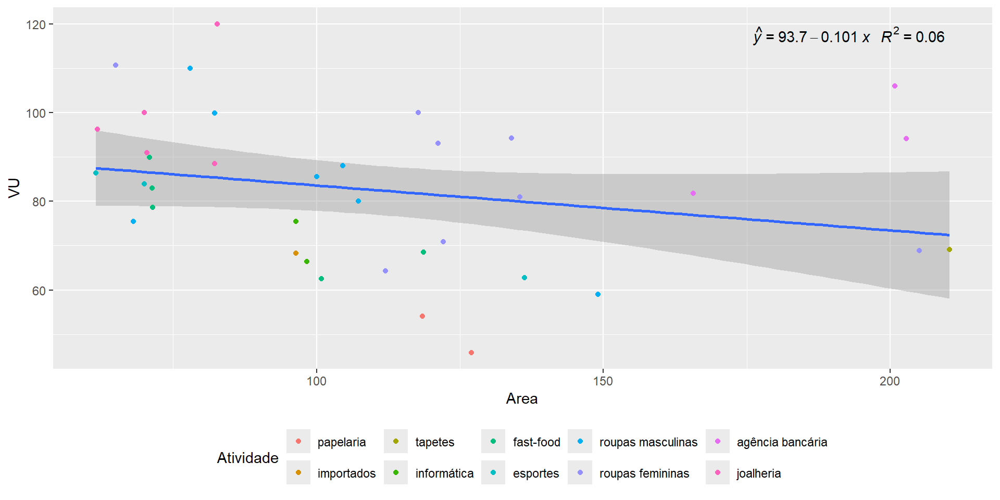{width=960}
:::
:::


## Lojas (modelo)


::: {.cell}
::: {.cell-output-display}
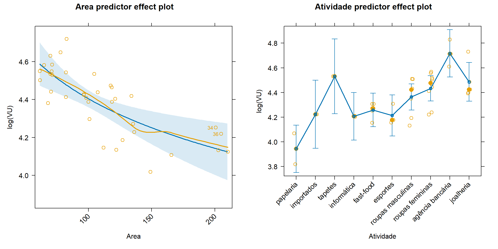{width=100%}
:::
:::


## Lojas


::: {.cell}
::: {.cell-output-display}
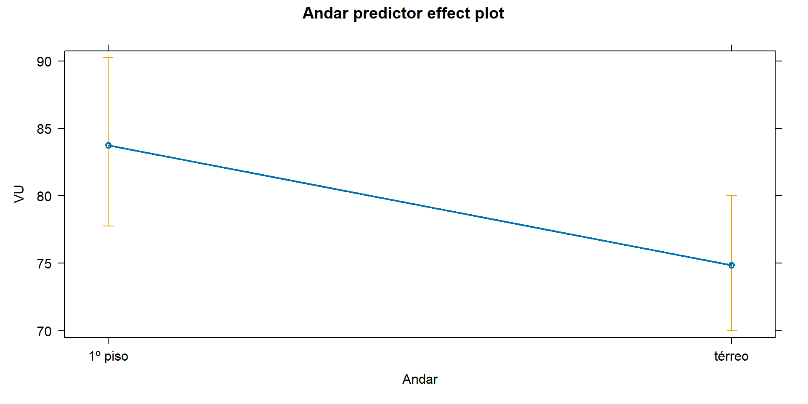{width=960}
:::
:::


## Lojas


::: {.cell}
::: {.cell-output-display}

`````{=html}
<table style="NAborder-bottom: 0;">
 <thead>
  <tr>
   <th style="text-align:left;"> Termo </th>
   <th style="text-align:right;"> Estimativa </th>
   <th style="text-align:right;"> Erro-padrão </th>
   <th style="text-align:right;"> Estatística t </th>
   <th style="text-align:right;"> p-valor </th>
  </tr>
 </thead>
<tbody>
  <tr>
   <td style="text-align:left;"> Intercepto </td>
   <td style="text-align:right;"> 5,78 </td>
   <td style="text-align:right;"> 0,48 </td>
   <td style="text-align:right;"> 12,02 </td>
   <td style="text-align:right;"> 0,00 </td>
  </tr>
  <tr>
   <td style="text-align:left;"> log(Area) </td>
   <td style="text-align:right;"> -0,38 </td>
   <td style="text-align:right;"> 0,10 </td>
   <td style="text-align:right;"> -3,84 </td>
   <td style="text-align:right;"> 0,00 </td>
  </tr>
  <tr>
   <td style="text-align:left;"> Andar Térreo </td>
   <td style="text-align:right;"> -0,11 </td>
   <td style="text-align:right;"> 0,05 </td>
   <td style="text-align:right;"> -2,17 </td>
   <td style="text-align:right;"> 0,04 </td>
  </tr>
  <tr>
   <td style="text-align:left;"> Importados </td>
   <td style="text-align:right;"> 0,28 </td>
   <td style="text-align:right;"> 0,16 </td>
   <td style="text-align:right;"> 1,70 </td>
   <td style="text-align:right;"> 0,10 </td>
  </tr>
  <tr>
   <td style="text-align:left;"> Tapetes </td>
   <td style="text-align:right;"> 0,59 </td>
   <td style="text-align:right;"> 0,17 </td>
   <td style="text-align:right;"> 3,45 </td>
   <td style="text-align:right;"> 0,00 </td>
  </tr>
  <tr>
   <td style="text-align:left;"> Informática </td>
   <td style="text-align:right;"> 0,26 </td>
   <td style="text-align:right;"> 0,13 </td>
   <td style="text-align:right;"> 1,99 </td>
   <td style="text-align:right;"> 0,06 </td>
  </tr>
  <tr>
   <td style="text-align:left;"> Fast-Food </td>
   <td style="text-align:right;"> 0,31 </td>
   <td style="text-align:right;"> 0,12 </td>
   <td style="text-align:right;"> 2,69 </td>
   <td style="text-align:right;"> 0,01 </td>
  </tr>
  <tr>
   <td style="text-align:left;"> Esportes </td>
   <td style="text-align:right;"> 0,27 </td>
   <td style="text-align:right;"> 0,13 </td>
   <td style="text-align:right;"> 2,16 </td>
   <td style="text-align:right;"> 0,04 </td>
  </tr>
  <tr>
   <td style="text-align:left;"> Roupas Masc. </td>
   <td style="text-align:right;"> 0,42 </td>
   <td style="text-align:right;"> 0,11 </td>
   <td style="text-align:right;"> 3,90 </td>
   <td style="text-align:right;"> 0,00 </td>
  </tr>
  <tr>
   <td style="text-align:left;"> Roupas Fem. </td>
   <td style="text-align:right;"> 0,49 </td>
   <td style="text-align:right;"> 0,10 </td>
   <td style="text-align:right;"> 4,70 </td>
   <td style="text-align:right;"> 0,00 </td>
  </tr>
  <tr>
   <td style="text-align:left;"> Bancos </td>
   <td style="text-align:right;"> 0,77 </td>
   <td style="text-align:right;"> 0,13 </td>
   <td style="text-align:right;"> 6,08 </td>
   <td style="text-align:right;"> 0,00 </td>
  </tr>
  <tr>
   <td style="text-align:left;"> Jóias </td>
   <td style="text-align:right;"> 0,54 </td>
   <td style="text-align:right;"> 0,12 </td>
   <td style="text-align:right;"> 4,37 </td>
   <td style="text-align:right;"> 0,00 </td>
  </tr>
</tbody>
<tfoot>
<tr><td style="padding: 0; " colspan="100%"><span style="font-style: italic;">Note: </span></td></tr>
<tr><td style="padding: 0; " colspan="100%">
<sup></sup> Erro-padrão dos resíduos:  0,13  em  25  graus de liberdade.</td></tr>
<tr><td style="padding: 0; " colspan="100%">
<sup>a</sup> R2:  0,74</td></tr>
<tr><td style="padding: 0; " colspan="100%">
<sup>b</sup> R2ajustado:  0,62</td></tr>
<tr><td style="padding: 0; " colspan="100%">
<sup>c</sup> RMSE:  0,11</td></tr>
</tfoot>
</table>

`````

:::
:::


## Lojas (avaliação)

* De posse do modelo acima, avaliar o valor mínimo do aluguel de uma loja de 
110m2, de roupas masculinas no piso térreo neste shopping center.


::: {.cell}

:::


* O valor calculado foi de: 74,71 [69,13; 
80,75]


## Terrenos

### Considerações importantes

* Primeiro há de se considerar o melhor uso, se comercial ou residencial
   + Terrenos residenciais, em geral, não são para locar.
   + Apenas os terrenos comerciais nos interessam aqui.
* Deve-se dar preferência ao Método Comparativo
   + Problema: pode haver falta de dados para comparação
   + Com poucos dados, pode ser viável apenas o tratamento por fatores
   + Pode-se buscar dados de terrenos com construções para aumentar a amostra,
   descontando, é claro, o valor das construções para efeito de comparativo
* Na ausência de dados em número suficiente, deve-se utilizar o Método da 
Remuneração do Capital

## Terrenos {.smaller}

### @damato [p. 204]


::: {.cell}
::: {.cell-output-display}


|Id | Índice Local|     Preço| Preço (FO)| Área| Frente Principal| Prof. Eq.| Frente Sec.| A. Construída| Padrão|  Fd|
|:--|------------:|---------:|----------:|----:|----------------:|---------:|-----------:|-------------:|------:|---:|
|1  |        1.800|   450.000|    450.000|  150|              5,0|     30,00|           0|           163|    1,2| 0,2|
|2  |          900|   180.000|    162.000|  180|              6,0|     30,00|           0|           150|    1,2| 0,2|
|3  |          900|   200.000|    180.000|  182|              5,5|     33,09|          33|           200|    1,2| 0,2|
|4  |          900|   160.000|    144.000|  220|             10,0|     22,00|          22|           150|    0,9| 0,2|
|5  |          900|   220.000|    198.000|  244|             10,0|     24,40|           0|           133|    1,2| 0,2|
|6  |        1.425| 1.474.000|  1.326.600|  268|             11,0|     24,36|           0|           150|    1,2| 0,2|


:::
:::


- Não se trata de um caso de aluguel resolvido pelo Comparativo.
  - Porém era mais natural apresentar aqui neste ponto.

## Terrenos (análise exploratória)


::: {.cell}
::: {.cell-output-display}
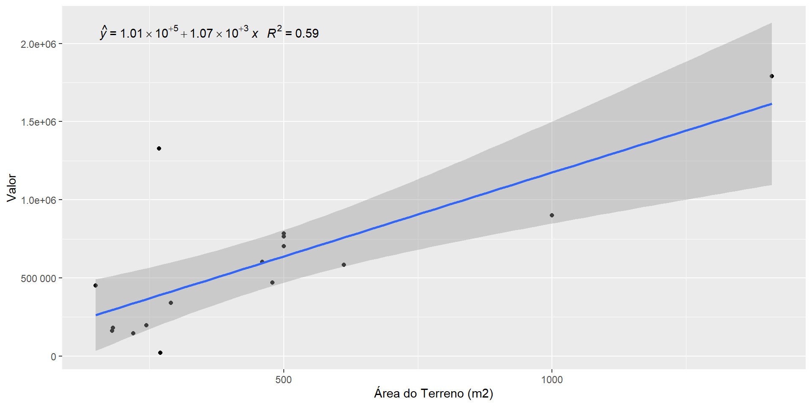{width=960}
:::
:::


## Terrenos (análise exploratória)


::: {.cell}
::: {.cell-output-display}
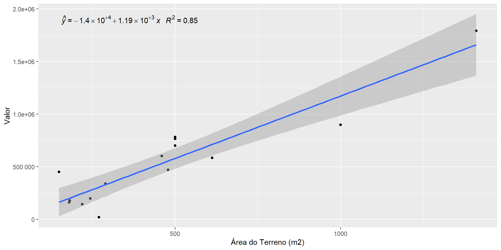{width=960}
:::
:::


## Terrenos 

### Cálculo do valor residual


::: {.cell}
::: {.cell-output-display}


|Id |     Preço| A. Construída| Padrão|  Fd| Valor da Construção| Valor Residual|
|:--|---------:|-------------:|------:|---:|-------------------:|--------------:|
|1  |   450.000|           163|    1,2| 0,2|           53.693,37|     396.306,63|
|2  |   180.000|           150|    1,2| 0,2|           49.411,08|     112.588,92|
|3  |   200.000|           200|    1,2| 0,2|           65.881,44|     114.118,56|
|4  |   160.000|           150|    0,9| 0,2|           37.058,31|     106.941,69|
|5  |   220.000|           133|    1,2| 0,2|           43.811,16|     154.188,84|
|6  | 1.474.000|           150|    1,2| 0,2|           49.411,08|   1.277.188,92|
|7  |    22.000|           170|    1,2| 0,2|           55.999,22|     -36.199,22|
|8  |   377.000|             0|     NA|  NA|                0,00|     339.300,00|
|9  |   670.000|             0|     NA|  NA|                0,00|     603.000,00|
|10 |   522.700|             0|     NA|  NA|                0,00|     470.430,00|


:::
:::


## Terrenos 


::: {.cell}
::: {.cell-output-display}
{width=960}
:::
:::


## Terrenos 


::: {.cell}
::: {.cell-output-display}
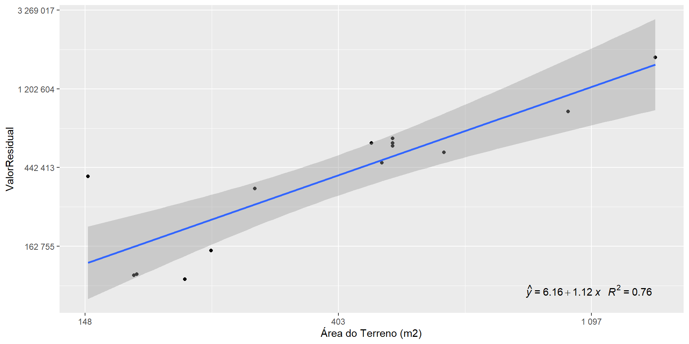{width=960}
:::
:::


## Terrenos 


::: {.cell}
::: {.cell-output-display}
{width=960}
:::
:::


## Terrenos (modelo) {.smaller}


::: {.cell}
::: {.cell-output-display}

`````{=html}
<table style="NAborder-bottom: 0;">
 <thead>
  <tr>
   <th style="text-align:left;"> Termo </th>
   <th style="text-align:right;"> Estimativa </th>
   <th style="text-align:right;"> Erro-padrão </th>
   <th style="text-align:right;"> Estatística t </th>
   <th style="text-align:right;"> p-valor </th>
  </tr>
 </thead>
<tbody>
  <tr>
   <td style="text-align:left;"> (Intercept) </td>
   <td style="text-align:right;"> 4,64 </td>
   <td style="text-align:right;"> 0,73 </td>
   <td style="text-align:right;"> 6,33 </td>
   <td style="text-align:right;"> 0 </td>
  </tr>
  <tr>
   <td style="text-align:left;"> log(Area) </td>
   <td style="text-align:right;"> 1,36 </td>
   <td style="text-align:right;"> 0,12 </td>
   <td style="text-align:right;"> 11,28 </td>
   <td style="text-align:right;"> 0 </td>
  </tr>
</tbody>
<tfoot>
<tr><td style="padding: 0; " colspan="100%"><span style="font-style: italic;">Note: </span></td></tr>
<tr><td style="padding: 0; " colspan="100%">
<sup></sup> Erro-padrão dos resíduos:  0,26  em  11  graus de liberdade.</td></tr>
<tr><td style="padding: 0; " colspan="100%">
<sup>a</sup> R2:  0,92</td></tr>
<tr><td style="padding: 0; " colspan="100%">
<sup>b</sup> R2ajustado:  0,91</td></tr>
<tr><td style="padding: 0; " colspan="100%">
<sup>c</sup> RMSE:  0,64</td></tr>
</tfoot>
</table>

`````

:::
:::


## Terrenos (avaliação)

* Valor de venda:

. . . 


::: {.cell}
::: {.cell-output .cell-output-stdout}

```
      fit      lwr     upr
1 1059833 905036.4 1241105
```


:::
:::


* Valor de Locação: $1.060.000,00*[(1+0,06)^{1/12}-1]=$ 5.159,60

## Armazéns {.smaller}

### @damato [p. 251]


::: {.cell}
::: {.cell-output-display}


| Id| A. terreno| A. Construída|   Galpão| Escrit.| Docas|Padrão   | Idade| Aluguel|    VU|
|--:|----------:|-------------:|--------:|-------:|-----:|:--------|-----:|-------:|-----:|
|  1|      1.350|        933,00|   733,00|   200,0|     2|Médio    |    10|  10.000|  7,41|
|  2|      2.513|      2.396,00| 1.481,00|   915,0|     2|Superior |     1|  28.750| 11,44|
|  3|      2.400|      2.400,00| 1.600,00|   800,0|     2|Médio    |    12|  30.000| 12,50|
|  4|     12.000|      2.420,00| 1.600,00|   820,0|     6|Superior |     1|  29.000|  2,42|
|  5|      3.290|      3.185,86| 3.185,76|     0,1|     4|Superior |     1|  38.000| 11,55|
|  6|         NA|      3.800,00| 3.100,00|   700,0|     2|Médio    |    10|  34.200|    NA|
|  7|      5.500|      4.000,00| 2.500,00| 1.500,0|    10|Médio    |    10|  40.000|  7,27|


:::
:::


- Considerado: $VU = \frac{Aluguel}{AreaTerreno}$

## Armazéns (análise exploratória)


::: {.cell}
::: {.cell-output-display}
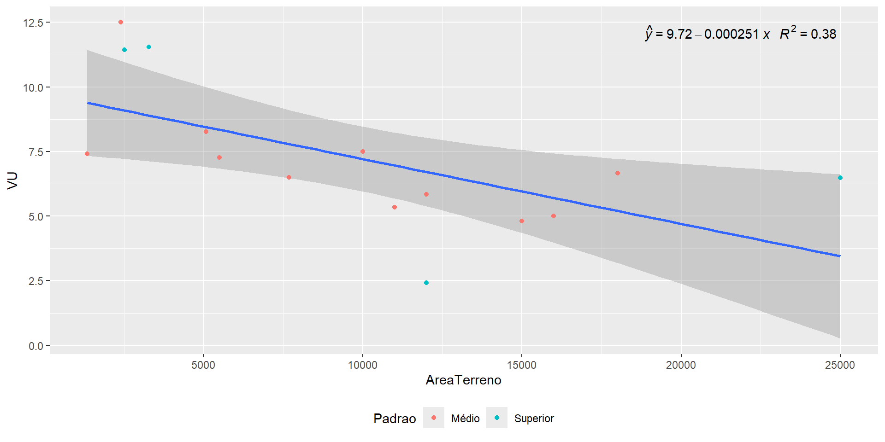{width=960}
:::
:::


## Armazéns (análise exploratória)


::: {.cell}
::: {.cell-output-display}
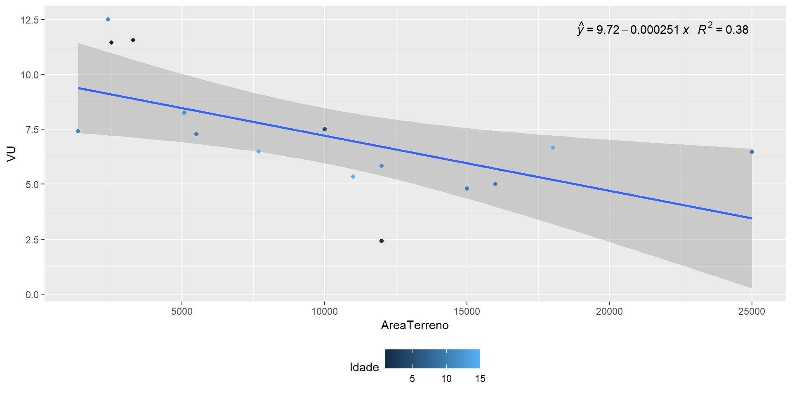{width=960}
:::
:::


## Armazéns (modelo) {.smaller}


::: {.cell}
::: {.cell-output-display}


|Termo                        | Estimativa| Erro-padrão| Estatística t| p-valor|
|:----------------------------|----------:|-----------:|-------------:|-------:|
|(Intercept)                  |       1,79|        0,06|         32,04|    0,00|
|log(AreaTerreno/15000)       |      -1,03|        0,12|         -8,70|    0,00|
|log(AreaConstruida/12086.22) |       0,83|        0,12|          6,63|    0,00|
|I(Idade - 10)                |      -0,02|        0,01|         -2,02|    0,07|


:::
:::


- Equação de Estimação: $$VU = 5,99.\left(\frac{AreaTerreno}{15000}\right)^{-1,03}.\left(\frac{AreaConstruida}{12.086,22}\right)^{0,83}.0,98^{Idade-10}$$

## Armazéns (modelo)


::: {.cell}
::: {.cell-output-display}
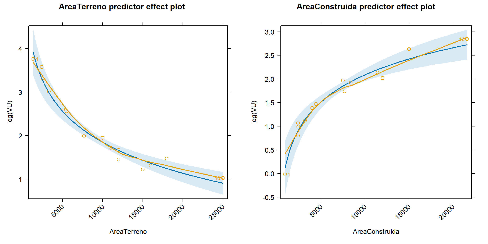{width=1152}
:::
:::


## Armazéns (modelo)


::: {.cell}
::: {.cell-output-display}
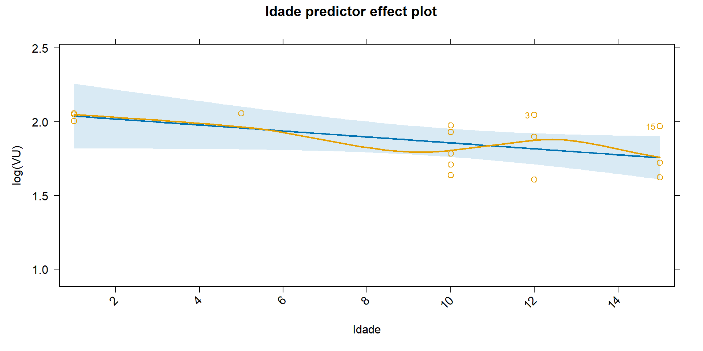{width=960}
:::
:::


## Armazéns (Poder de Predição)


::: {.cell}
::: {.cell-output-display}
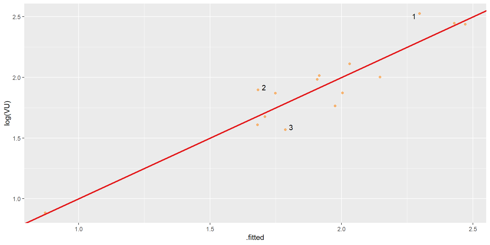{width=960}
:::
:::


## Armazéns (Poder de Predição)


::: {.cell}
::: {.cell-output-display}
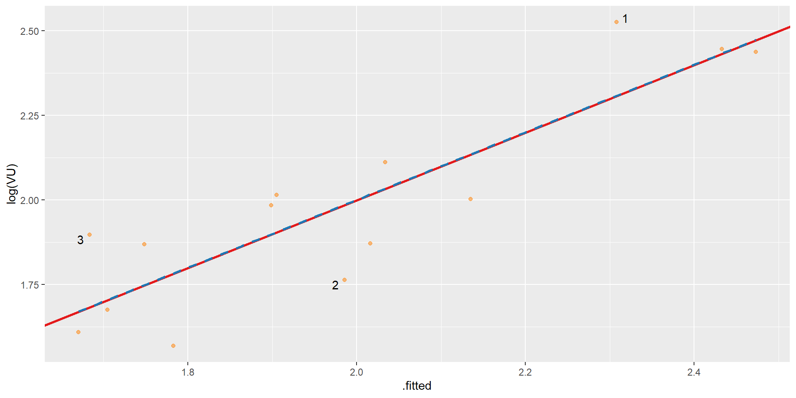{width=960}
:::
:::


## Armazéns (Avaliação)

* De posse do modelo acima, avaliar o valor do aluguel de um armazém com terreno
de área igual a 15.000 m2, com Área Construída de 12.086,22 e Idade igual a 
5 anos.

. . . 


::: {.cell}

```{.r .cell-code}
p <- predict(fit1, newdata = list(AreaTerreno = 15000, AreaConstruida = 12086.22,
                                 Idade = 5),
             interval = "confidence", level = 0.80)
exp(p)
```

::: {.cell-output .cell-output-stdout}

```
       fit      lwr      upr
1 6.602145 5.823431 7.484988
```


:::
:::


- O valor calculado foi de: 89.128,96 
[78.616,33; 101.047,34]

- @damato [p. 254]: R$ 90.936,00
  - Modelo: $\frac{1}{Area} = 2,5765.10^{-5}+\frac{0,09618}{\text{Area Construida}}-3,7878.10^{-6}.\text{Conservacao}$

# Casos Especiais

## Cinemas

- Em casos especiais, como nos cinemas, pode ser utilizado o *Método da Participação*
  - Tal método consiste em:
    - Aferir a renda líquida do estabelecimento
    - Aplicar a esta renda líquida um percentual médio de mercado para calcular
    o aluguel justo ao locador
    
- Segundo @damato [p. 296]:

. . . 

> Obtida a média final (das rendas líquidas), seria a mesma capitalizada em base
às taxas de renda usuais para cinemas que são: 10% quando os equipamentos e 
instalações são de propriedade do inquilino e 15% quando pertencem ao 
proprietário do imóvel.

## Cinemas {.smaller}

### Exemplo [@damato, p. 297]


::: {.cell}
::: {.cell-output-display}


|Mês        | Renda Líquida|    IGP-M| Renda Líquida Descontada|
|:----------|-------------:|--------:|------------------------:|
|2015-01-01 |    116.167,51| 1.353,50|               129.193,03|
|2015-02-01 |     88.737,28| 1.357,15|                98.421,39|
|2015-03-01 |    115.604,24| 1.370,45|               126.976,04|
|2015-04-01 |    151.524,24| 1.386,49|               164.504,72|
|2015-05-01 |    189.658,44| 1.392,17|               205.064,97|
|2015-06-01 |    192.050,52| 1.401,50|               206.269,37|


:::
:::

::: {.cell}

:::


- @damato [p. 297]: $Al = 185.358,54\times12\% =\text{R\$ }22.240,00$

## Problema


::: {.cell}

```{.r .cell-code}
tapply(dadosCinema$`Renda Líquida Descontada`, dadosCinema$Ano, mean)
```

::: {.cell-output .cell-output-stdout}

```
    2015     2016     2017 
167305.2 185869.9 202900.5 
```


:::
:::


- O resultado tem aumentado anualmente em torno de 10% a.a.
- Ao considerar a média dos rendimentos anuais, @damato obtiveram um aluguel
condizente com o ano de 2016!
- Isto não me parece correto!

## Problemas com o Método da Participação {.smaller}

> Foram apresentados métodos de participação para "postos de gasolina" e para
"cinemas". O método para "postos de serviços" foi desenvolvido pelo engenheiro
José Carlos Pellegrino e para os "cinemas", pelo engenheiro Nelson Roberto
Pereira Alonso. Nesses processos de participação, o aluguel é vinculado ao 
resultado comercial do estabelecimento empresarial do inquilino.
Se, por um lado, possui a vantagem de permitir o estabelecimento do aluguel para
imóveis com destinação específica, tem, na opinião do autor, as desvantagens de
punir o bom e permiar o mau comerciante, e ainda de impedir que o proprietário
usufrua da renda de seu patrimônio de uma forma mais lucrativa do que aquela para 
o qual originalmente foi destinado.

> Se, por qualquer motivo, a destinação original que foi dada ao imóvel passar 
a ser inviável, não é dado ao proprietário do prédio o direito de se afastar
desse "prejuízo"...

## Referências
